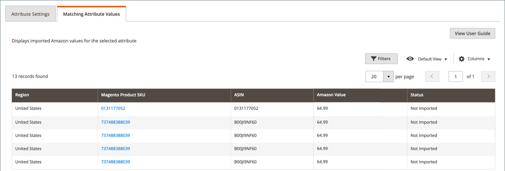

# Visa Amazon-attributmappning

När du mappar Amazon-attribut till [!DNL Commerce]-attribut, spåras Amazon försäljningskanal och en filterbar lista över alla Amazon-värden visas. Använd den här sidan om du vill verifiera värden för dina länkade [!DNL Commerce]-attribut som synkroniseras korrekt mellan [!DNL Commerce] och Amazon. Du kan granska synkroniserade värden för Amazon-attribut som är länkade eller inte länkade till ett [!DNL Commerce]-attribut. Mer information om hur du skapar eller redigerar Amazon-attribut finns i [Skapa och redigera attribut](./creating-attributes.md).

_Amazon-värdet_ varierar beroende på vilken attributtyp och vilket Amazon-attribut du visar. Ett angivet Amazon-värde för `Label` skulle till exempel vara ett textvärde medan `AmazonListPrice` skulle vara ett numeriskt värde. Statusen anger om Amazon-värdet har importerats.

## Visa dina attributvärden

1. Gå till **[!UICONTROL Marketing]** > _[!UICONTROL Channels]_>**[!UICONTROL Amazon Sales Channel]**på sidofältet_[!UICONTROL Admin]_.

1. Klicka på **[!UICONTROL Attributes]** på den vänstra menyn, leta upp ett Amazon-attribut och klicka antingen på **[!UICONTROL Create]** eller **[!UICONTROL Edit]** i kolumnen _[!UICONTROL Action]_.

1. Klicka på fliken **[!UICONTROL Matching Attribute Values]**.

   Listor som har en motsvarande [!DNL Commerce]-katalogprodukt visar ett länkat värde i _Magento-produkt-SKU_-kolumnen. Om du klickar på en länk öppnas motsvarande katalogproduktinformationssida. Ändringar av Amazon-attribut på produktinformationssidan synkroniseras inte tillbaka till Amazon försäljningskanal.

>[!TIP]
>Mer information om hur du redigerar eller tilldelar mappningen för en lista till en katalogprodukt finns i [Uppdatera obligatorisk information](./amazon-manually-update-incomplete-listing.md).

| Fält | Beskrivning |
|--- |--- |
| [!UICONTROL Region] | Regionen för försäljningsaktivitet som definieras i **[!DNL Amazon Marketplace]Land** under butiksintegrering. |
| [!UICONTROL Magento Product SKU] | Anger [!DNL Commerce]-produkterna som synkroniseras med Amazon Store. Värdet är ett produkt-ID som tilldelats av [!DNL Commerce] och är länkat till en produkt i katalogen. Klicka på länken om du vill öppna produkten i [!DNL Commerce]. |
| [!UICONTROL ASIN] | Anger den 10-ställiga alfanumeriska unika identifierare som Amazon har tilldelat produkten för att identifiera produkten. |
| [!UICONTROL Amazon Value] | Anger värdet för det valda attributet. Amazon-värdet varierar beroende på vilken attributtyp och vilket Amazon-attribut du ser. Ett angivet Amazon-värde för `Label` skulle till exempel vara ett textvärde medan `AmazonListPrice` skulle vara ett numeriskt värde. Statusen anger om Amazon-värdet har importerats. |
| [!UICONTROL Status] | Anger om attributvärdena har importerats till [!DNL Commerce] och länkats till ett [!DNL Commerce]-attribut. Alternativ: `Not Imported` / `Imported` |
