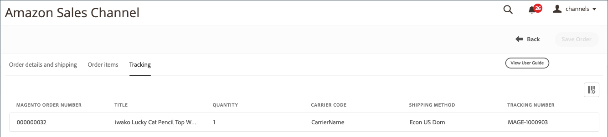

# Beställningsinformation för Amazon

{width="600" zoomable="yes"}

## Visa beställningsinformation för Amazon

1. Klicka **[!UICONTROL View Store]** på butikskortet.

1. I _[!UICONTROL Recent Orders]_klickar du på ett ordernummer.

   The _[!UICONTROL Amazon Order Details]_sidan öppnas.

>[!NOTE]
>
>Om orderimport är aktiverat i [Orderinställningar](./order-settings.md) och beställningen är [Uppfylls av Amazon (FBA)](./fulfilled-by.md)kan du se exempeldata för vissa fält i orderinformationen. Amazon skickar inte följande data för FBA-beställningar.
>
> - `AddressType`
> - `AddressLine1`
> - `AddressLine2`
> - `AddressLine3`
> - `BuyerName`
> - `Phone`
> - `PurchaseOrderNumber`
> - `RecipientName`
> - `CustomizedURL`
> - `GiftMessageText`

### Fliken Order and Shipping Details

The _[!UICONTROL Order and Shipping Details]_På -fliken visas detaljerad beställningsinformation som du fått från Amazon.

>[!IMPORTANT]
>
>Amazon godkänner icke-standardadressinformation som inte kan importeras till Amazon försäljningskanal, vilket förhindrar att delstat-/landskoderna uppdateras korrekt för vissa order. Följande fält kan redigeras i orderinformationen för att korrigera adressfel:
>
>- `Shipping address 1`
>- `Shipping address 2`
>- `Shipping address 3`
>- `Shipping city`
>- `Shipping region`
>- `Shipping postal code`
>- `Shipping country`
>
>Glöm inte att klicka **Spara ordning** när du har redigerat.

{width="600" zoomable="yes"}

### Fliken Orderposter

The _[!UICONTROL Order Items]_På -fliken visas alla objekt som är kopplade till Amazon-beställningen, enligt Amazon.

{width="600" zoomable="yes"}

### Fliken Spårning

The _[!UICONTROL Tracking]_-fliken visar spårningsinformation som är kopplad till Amazon-beställningen.

{width="600" zoomable="yes"}
