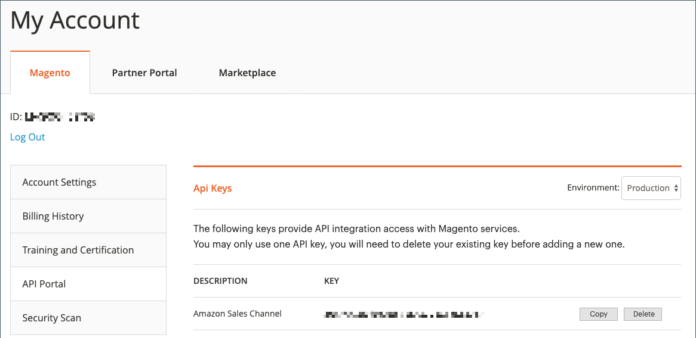

# Lägg till eller verifiera Amazon API-nyckeln

När du använder Amazon-försäljningskanal kontrollerar och validerar [!DNL Commerce] automatiskt den Amazon API-nyckel som du har lagt till i din butikskonfiguration. Om den valideras kan du gå vidare till nästa steg, [Store Integration](./store-integration.md).

Om Amazon API-nyckeln saknas, är ogiltig eller har gått ut måste du uppdatera nyckeln. Ett meddelande visas med en uppmaning om att skaffa en API-nyckel och lägga till nyckeln i din konfiguration för Amazon-försäljningskanal.

## Hämta och lägg till Amazon API-nyckeln enligt uppmaningen

API-nyckeln valideras varje gång du öppnar din Amazon-försäljningskanal.

1. Logga in på [!DNL Commerce]-administratören.

1. Gå till **[!UICONTROL Marketing]** > _[!UICONTROL Channels]_>**[!UICONTROL Amazon Sales Channel]**på sidofältet_[!UICONTROL Admin]_.

   Om det är första gången du använder Amazon försäljningskanal eller om API-nyckeln måste uppdateras, får du en fråga från systemet.

   {width="500"}

1. Klicka på **[!UICONTROL Sign in]** för att komma åt ditt [!DNL Commerce]-webbkonto.

   Sidan Commerce-konton öppnas i en ny webbläsare.

   - Om du är inloggad på ditt [!DNL Commerce]-konto visas _[!UICONTROL API Portal]_-avsnittet på_[!UICONTROL My Account]_-sidan automatiskt.

   - Om du inte är inloggad uppmanas du att ange ditt användarnamn och lösenord för [!DNL Commerce]-kontot innan fliken _[!UICONTROL API Portal]_visas.

   - Om du inte har något konto kan du gå till [sidan för [!DNL Commerce] kontot](https://account.magento.com/customer/account/login/){target="_blank"} och registrera dig. Det här kontot ska ingå i ditt företag eller din verksamhet.

1. Om det behövs kan du visa och generera API-nycklar på fliken _[!UICONTROL API Portal]_i ditt [!DNL Commerce]-konto.

   Om du vill skapa en API-nyckel anger du en beskrivning som `Amazon Sales Channel` och klickar på **[!UICONTROL Add New]**. Den nya nyckeln genereras och visas med det namn du angav. Klicka på **[!UICONTROL Copy]** om du vill kopiera den nya nyckeln.

   {width="500" zoomable="yes"}

1. När den nya nyckeln har genererats och kopierats går du tillbaka till fliken _[!UICONTROL Amazon Sales Channel]_i webbläsaren.

1. Klicka på **[!UICONTROL Add the key]** på sidan _[!UICONTROL Welcome to Amazon Sales Channel]_.

   Webbläsaren avslutar Amazon försäljningskanal och en butikskonfigurationssida öppnar sidan _[!UICONTROL Api Keys]_i [!DNL Commerce] Admin. Du kan öppna den här sidan manuellt när du går till **[!UICONTROL Stores]**>_[!UICONTROL Settings]_ > **[!UICONTROL Configuration]**, expanderar **[!UICONTROL Services]** i den vänstra panelen och väljer **[!UICONTROL Magento Services]**.

1. Klistra in den kopierade nyckeln för **[!UICONTROL Production Api key]**.

1. Klicka på **[!UICONTROL Save Config]**. Nu kan du gå tillbaka till Amazon försäljningskanal.

   {width="600" zoomable="yes"}

1. Gå till **[!UICONTROL Marketing]** > _[!UICONTROL Channels]_>**[!UICONTROL Amazon Sales Channel]**på sidofältet_[!UICONTROL Admin]_.

   Om du får åtkomst till Amazon-försäljningskanalen utlöses [!DNL Commerce], verifieras och valideras din API-nyckel så att du kan fortsätta.

   Om du uppmanas att verifiera nyckeln igen upprepar du processen _Lägg till och verifiera_.

 [**Fortsätt till Store-integrering**](./store-integration.md)
