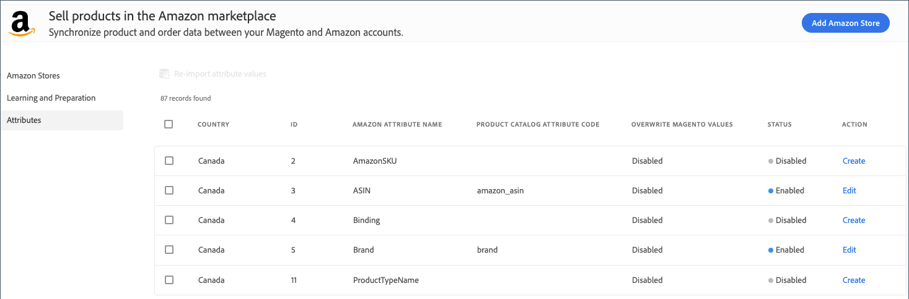

# Attribut

I vyn _[!UICONTROL Attributes]_visas din lista över Amazon- och [!DNL Commerce]-attribut. Listan innehåller även attribut som har mappats för produktmatchning. Mer information finns i [Hantera attribut](./managing-attributes.md).

I vyn _[!UICONTROL Attributes]_kan du granska attributinställningarna i tabellen och [skapa eller redigera](./creating-attributes.md) ett attribut.

## Visa din attributlista

1. Gå till **[!UICONTROL Marketing]** > _[!UICONTROL Channels]_>**[!UICONTROL Amazon Sales Channel]**på sidofältet_ Admin _.

1. Klicka på **[!UICONTROL Attributes]** på den vänstra menyn, leta upp ett Amazon-attribut och granska din attributlista.

1. Skapa eller redigera ett attribut efter behov:

   - Om du vill [skapa](./creating-attributes.md#create-an-attribute) och definiera matchande attributvärden för attributet klickar du på **[!UICONTROL Create]**.

   - Om du vill inaktivera eller [redigera inställningarna](./creating-attributes.md#edit-an-attribute) eller Matchande attributvärden för attributet klickar du på **[!UICONTROL Edit]**.

      När du redigerar ett attribut ändrar du attributmappningen för produktmatchning.

| Fält | Beskrivning |
|--- |--- |
| [!UICONTROL Country] | Land för försäljningsaktivitet som definieras i **[!DNL Amazon Marketplace]Land** under [butiksintegrering](./store-integration.md). |
| [!UICONTROL ID] | Allmänt attributvärde som genereras av [!DNL Commerce] när attributet skapas. |
| [!UICONTROL Amazon Attribute Name] | Namnet på attributet som har importerats från Amazon. |
| [!UICONTROL Product Catalog Attribute Code] | Om attributet [!DNL Commerce] är mappat till _[!UICONTROL Amazon Attribute Name]_för matchande katalog- och listprodukter. |
| [!UICONTROL Overwrite Magento Values] | Om attributet är inställt på `Overwrite Existing Magento Values` i attributinställningarna visas `Enabled` i tabellen. Aktiverad innebär att när uppdaterad produktinformation för attributet tas emot från Amazon, uppdateras (skrivs över) motsvarande information för produkten i din [!DNL Commerce]-katalog. Den kan även påverka de produkter som finns i [!DNL Commerce]-butikerna. |
| Status | Anger om attributvärdena har importerats till [!DNL Commerce] och mappats till ett [!DNL Commerce]-attribut. Alternativ: `Enabled` / `Disabled` |
| Åtgärd | Anger de åtgärdsalternativ som är tillgängliga för attributet. Alternativ: `Create` / `Edit` |
