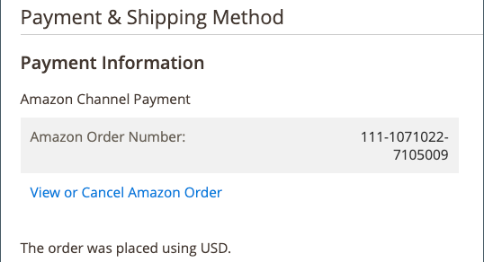

# Vanliga orderbearbetningsuppgifter

[[!DNL Commerce] orderhantering](https://docs.magento.com/user-guide/sales/order-processing.html){target="_blank"} kan hantera dina Amazon-beställningar, inklusive skicka e-post till köparen, utföra beställningen (frakten), utfärda krediter/återbetalningar, lägga till kommentarer och mycket annat. För att hantera dina Amazon-beställningar [**Importera Amazon-beställningar**](./order-settings.md) inställningen måste anges till `Enabled` så att motsvarande [!DNL Commerce] beställningar skapas när Amazon-beställningar tas emot. Amazon beställningsinformation finns i *[!UICONTROL Recent Orders]* -avsnittet på butikspanelen.

När det är aktiverat, motsvarar [!DNL Commerce] beställningar skapas för Amazon och Amazon ordernummer visas i _[!UICONTROL Order Number]_kolumn. Om en motsvarande [!DNL Commerce] ordern skapas, klicka på ordernumret för att öppna ordern i [!DNL Commerce] [orderhantering](https://docs.magento.com/user-guide/sales/order-processing.html){target="_blank"} page. You can manage the order as you do your other [[!DNL Commerce] order processing](https://docs.magento.com/user-guide/sales/order-processing.html){target="_blank"}.

The [!DNL Commerce] ordernumret visas inte med _[!UICONTROL Recent Orders]_information. The [!DNL Commerce] ordernumret visas bara när du klickar på ordernumret på butikens kontrollpanel och öppnar ordern i [[!DNL Commerce] orderhantering](https://docs.magento.com/user-guide/sales/order-processing.html){target="_blank"}. När du visar [!DNL Commerce] beställningen visas Amazon ordernummer i *[!UICONTROL Payment & Shipping Method]*-avsnitt. Den innehåller även alternativ för att *[!UICONTROL View or Cancel Amazon Order]*och *[!UICONTROL View all Amazon Orders]*, beroende på orderns leveransstatus.

Se [avbryta en ej levererad order](./cancel-unshipped-order.md).

När en Amazon-beställning bearbetas uppdateras och synkroniseras beställningsinformationen med din [!DNL Amazon Seller Central] konto. Dina kreditinställningar avgör hur ofta beställningsinformation synkroniseras mellan Amazon och Amazon försäljningskanal.

Vanliga [!DNL Commerce] [orderhantering](https://docs.magento.com/user-guide/sales/order-processing.html){target="_blank"} uppgifter:

- [Orderåtgärder](https://docs.magento.com/user-guide/sales/order-actions.html){target="_blank"}
- [Ordningssökning](https://docs.magento.com/user-guide/sales/orders-search.html){target="_blank"}
- [Bearbeta en beställning](https://docs.magento.com/user-guide/sales/order-processing.html){target="_blank"}
   - [Visa en order](https://docs.magento.com/user-guide/sales/order-processing.html#view-an-order){target="_blank"}
   - [Bearbeta en beställning](https://docs.magento.com/user-guide/sales/order-processing.html#process-an-order){target="_blank"}
   - [Beställnings- och kontoinformation](https://docs.magento.com/user-guide/sales/order-processing.html#order-and-account-information){target="_blank"}
   - [Adressinformation](https://docs.magento.com/user-guide/sales/order-processing.html#address-information){target="_blank"}
   - [Betalnings- och leveranssätt](https://docs.magento.com/user-guide/sales/order-processing.html#payment--shipping-method){target="_blank"}
   - [Granska beställda artiklar](https://docs.magento.com/user-guide/sales/order-processing.html#review-items-ordered){target="_blank"}
- [Utfärda kredit/återbetalning](https://docs.magento.com/user-guide/sales/credit-memo-create.html){target="_blank"}
- [Fylla i/leverera en order](https://docs.magento.com/user-guide/sales/shipments-create.html){target="_blank"}
- [Skapa en faktura](https://docs.magento.com/user-guide/sales/invoice-create.html){target="_blank"}
- [Avbryt en ej levererad order](./cancel-unshipped-order.md)

>[!NOTE]
>
>Om en order finns `Unshipped` status kan du [avbryta en Amazon-beställning](./cancel-unshipped-order.md) på [[!UICONTROL Amazon Order Details]](./amazon-order-details.md) sida. Om en order har skickats kan den inte annulleras.

Se [Hantering av handelsorder](https://docs.magento.com/user-guide/sales/order-management.html){target="_blank"}.
