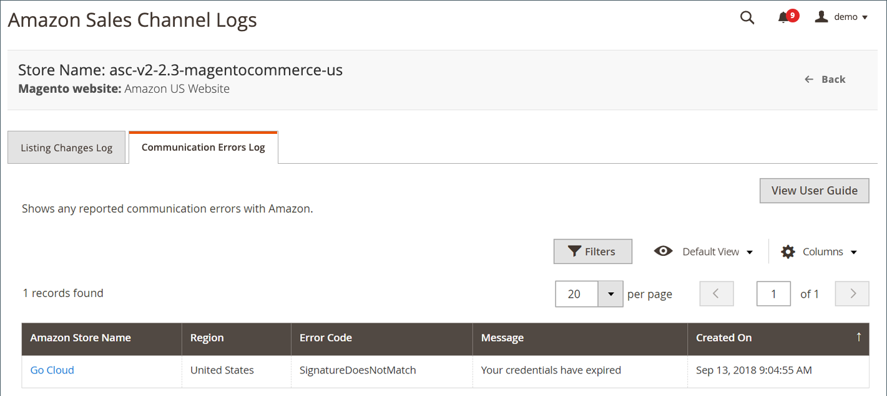

# Amazon fellogg för kommunikationsfel

The [!UICONTROL Communication Errors] Logg visar rapporterade kommunikationsfel med Amazon. Informationen innehåller information om Amazon säljkanalsbutik, felkod och kortfattad beskrivning samt datum och tid för felet.

Inga åtgärder är tillgängliga för loggen. Det är en funktion som bara är till för granskning.

Amazon hemsidor för försäljningskanaler delar några vanliga sidor [arbetsytekontroller](./workspace-controls.md) som gör att du kan anpassa de data som visas.

{width="600" zoomable="yes"}

## Standardkolumner

| Kolumn | Beskrivning |
|--------------------------------|-----------------------------------------------------------------------------------------------------------------------|
| [!UICONTROL Amazon Store Name] | Namnet på butiken som definierades när Amazon Store konfigurerades. Se [Butiksintegrering](./store-integration.md). |
| [!UICONTROL Error Code] | Koden som togs emot från Amazon för att identifiera feltypen. |
| [!UICONTROL Message] | Meddelandet som beskriver felet som är associerat med felkoden. |
| [!UICONTROL Created On] | Datum och tid då felet inträffade. |
