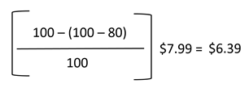

# Regel för intelligent omprisering: Villkorsavvikelser för konkurrenter

Avsnitt i en intelligent regel för återprissättning omfattar:

- [[!UICONTROL Select Rule Type]](./intelligent-repricing-rules.md)
- [!UICONTROL Competitor Conditional Variances]
- [[!UICONTROL Price Adjustment]](./price-adjustment.md)
- [[!UICONTROL Floor Price]](./floor-price.md)
- [[!UICONTROL Optional Ceiling Price]](./optional-ceiling-price.md)

En intelligent regel för omprissättning använder Amazon konkurrenters priser för att fastställa ert pris. Konkurrenterna är andra säljare som listar samma produkter som du listar på Amazon.

Om det finns en produkt med samma villkor är basmatchningspriset [lägsta konkurrent](./lowest-competitor-pricing.md) priset med samma villkor. Om ingen konkurrentprodukt matchar ditt villkor, går basmatchningspriset igenom andra tillgängliga konkurrensvillkor som börjar med New, Refurbished och fortsätter med tillgängliga villkor. När ett villkor har hittats blir basmatchningspriset det lägsta priset i det villkoret.

Om du har en produkt med villkoret `Used; Good` och baspriset, och en konkurrent har samma produkt i samma skick till ett lägre pris, används konkurrentpriset. Om det inte finns någon konkurrent med samma villkor söker systemet efter en konkurrent med nästa villkor, som är `New`. Om en konkurrent hittas med det villkoret används det lägsta priset.

## Konfigurera villkorsavvikelser för konkurrent

Definiera dina villkorsavvikelser i _[!UICONTROL Competitor Conditional Variances]_-avsnitt.

För **[!UICONTROL Conditional Variance]** väljer du ett alternativ:

- `Use all competitor's product conditions` - (Standard) Välj när du vill att produkten ska jämföras med något tillgängligt villkor (om det inte finns någon matchning för villkoret som du anger).

- `Use Only Matching Competitor's Product Condition` - Välj när du vill att din produkt endast ska jämföras med konkurrentens produkter i samma skick. Om det inte finns någon matchning får produkten priset _Magento, priskälla_ definieras i [Listpris](./listing-price.md).

- `Apply Variance (if competitor's product condition differs)` - Välj att först försöka jämföra med ditt matchade produktvillkor. Om det inte finns något matchande villkor används en avvikelse (som ett procenttal) i förhållande till ditt produktvillkor och den lägsta konkurrentens villkor.

   När _[!UICONTROL Apply Variance]_har valts visas ytterligare variansfält för var och en av dina Amazon-villkor. Med den här funktionen kan ni använda smarta regler för omprissättning när ni erbjuder produkter som är i ett annat skick än konkurrenterna. För att förstå beräkningen bakom villkorlig avvikelse måste du först förstå att alla avvikelser bestäms utifrån ett basmatchningspris.

   Alternativen för villkorlig avvikelse som visas baseras på dina listinställningar för `Condition` som mappas till villkorsvärden med en [!DNL Commerce] [produktattribut](https://docs.magento.com/user-guide/catalog/product-attributes.html){target="_blank"}. För alla mappade villkor kan du definiera en avvikelseprocent på 1-100. Undantaget är samlarföremål, i vilket fall ett procenttal större än 100 kan tillämpas.

| Fält | Beskrivning |
|--- |--- |
| [!UICONTROL Competitor Conditional Variances] | Alternativ: <ul><li>**[!UICONTROL Use all competitor's product conditions]** - Om det inte finns någon matchning för villkoret som du anger produkten med, matchar det här alternativet alla tillgängliga villkor. Först försöker den matcha ditt tillstånd och sedan fungerar den från `New` villkor till `Used; Acceptable`.</li><li>**[!UICONTROL Use only matching competitor's product condition]** - Det här alternativet matchar produktens villkor. Om det inte finns någon matchning får du produktpriserna på _[!UICONTROL Magento Price Source]_.</li><li>>**[!UICONTROL Apply variance (if competitor's product condition differs)]** - Det här alternativet försöker först matcha mot ditt produktvillkor. Om det inte finns något matchande villkor tillämpas en avvikelse (i procent) i förhållande till ditt produktvillkor och den lägsta konkurrentens villkor.</li></ul>  Alternativen för villkorlig avvikelse som visas baserat på listinställningarna för Villkor som mappas till villkorsvärden med en [!DNL Commerce] [produktattribut](https://docs.magento.com/user-guide/catalog/product-attributes.html){target="_blank"}. För alla mappade villkor kan du ange en avvikelseprocent på 1-100. Undantaget är samlarföremål, i vilket fall ett procenttal större än 100 kan tillämpas.  Med den här funktionen kan ni använda smarta regler för omprissättning när ni erbjuder produkter som är i ett annat skick än konkurrenterna. För att förstå beräkningen bakom villkorlig avvikelse måste du först förstå att alla avvikelser bestäms utifrån ett basmatchningspris. |

## Beräkna basen för villkorlig avvikelse

- BMC (Base Match Condition Variance) = Avvikelsen för villkoret för din matchningspris. BMC är variansen för `New` villkor.
- MCV (Merchant Condition Variance) = Variansen för produktens skick. Med hjälp av det tidigare exemplet är MCV = variansen för `Used; Good` villkor.
- BMP (Base Match Price) = $7,99 (förklaras ovan)

Formeln för beräkning av villkorlig avvikelsebas är följande:

## Exempel

Inställningar för villkorlig avvikelse är följande:

- BMC = 100 (konkurrentvillkor = Nytt)
- MCV = 80 (affärsvillkor = Använt; Bra)
- BMP = 7,99 USD (basmatchningspris = det lägsta priset för matchande konkurrentvillkor)

Med hjälp av den villkorliga avvikelsebasberäkningen ovan är din villkorliga avvikelsebas = $6,39. Beräkningen är den priskälla som konkurrenten använde för prisregelåtgärder, vilket förklaras ytterligare i [Prisjustering](./price-adjustment.md).
