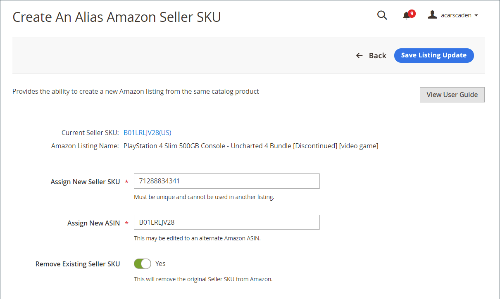

# Skapa en Alias Amazon Seller SKU

An [!DNL Alias Amazon Seller SKU] används för att skapa en Amazon-lista från samma produkt i [!DNL Commerce] katalog. Om du är en erfaren Amazon-försäljare kan du känna till [Amazon Global SKU](https://sellercentral.amazon.com/gp/help/external/help.html?itemID=201394090){target="_blank"} och Marketplace-specifik SKU för lager och frakt. I enlighet med liknande principer för Amazon försäljningskanal styr Amazon Seller SKU produktlistningsinformation på flerregional nivå samt [!DNL Alias Amazon Seller SKU] kan användas för att kontrollera produktlistinformation på en regionspecifik nivå.

Den här funktionen kan användas för att utföra två funktioner:

- Skapa en [!DNL Alias Amazon Seller SKU] för någon av [!DNL Commerce] katalogprodukter för att kontrollera regionspecifik listinformation.

   **Exempel**: Du är säljare i både USA och Kanada. Kom ihåg att var och en av Amazon försäljningskanalbutiker bara kan tilldelas en Amazon-region under installationen. Du har alltså en Amazon-återförsäljare med en definierad region i USA och en annan butik med en definierad region i Kanada. Båda butikerna delar din [!DNL Commerce] Katalog för att visa information i båda regionerna, inklusive produktattributen Amazon Seller SKU och ASIN. Listorna för katalogprodukten är alltså desamma i båda butikerna, aktiekurser, aktiekvantitet och andra produktattribut. Men ert lager för ert företag i Kanada levererar från Kanada och ert företag i USA levererar från USA. Du bör därför kontrollera listkvantiteten för varje butik separat. För att uppnå den här typen av regionspecifik kontroll kan du skapa en SKU för Alias Amazon Seller.

   Det innebär att du kan skapa en SKU för Alias Amazon Seller som är länkad till samma katalogprodukt och kan användas för att publicera om samma lista i den regionen.

- Skapa en [!DNL Alias Amazon Seller SKU] och matchar en av dina [!DNL Commerce] katalogprodukter till två Amazon-listor.

   **Exempel**: Du har en katalogprodukt som matchar en Amazon-lista. Eftersom Amazon ofta har flera listor som representerar samma produkt, upptäcker du att det finns en annan Amazon-lista för samma produkt, men Amazon har tilldelat en annan ASIN till listan. Om du vill öka produktsynligheten så att den omfattar, vill du matcha katalogprodukten med olika ASIN och skapa listor för båda ASIN-värdena. För att uppnå detta kan du skapa en SKU för Alias Amazon Seller.

   Du kan skapa en [!DNL Alias Amazon Seller SKU] som kan användas för att matcha en enskild katalogprodukt med en andra Amazon-lista och skapa en lista för den nya matchade ASIN. I det här fallet har du två Amazon-listor för samma katalogprodukt.

   När du har skapat en SKU för Alias Amazon Seller kan du använda dina listinställningar, regler och åsidosättningar för att styra listinformationen för regionen. Produktattribut som kan definieras per region för en lista omfattar kvantitet/lager, leveransmetod, villkor, produktberättigande och hanteringstid.

## Används för ett regionspecifikt ändamål {#region-specific}

Visa listan på _[!UICONTROL Product Listings]_sida (_[!UICONTROL Inactive]_, _Aktiv_, _Ej giltiga_, eller _Avslutade_ -fliken).

1. Under _[!UICONTROL Actions]_, klicka **[!UICONTROL Create Alias Seller SKU]**.

1. För **[!UICONTROL Assign New Seller SKU]** anger du ett unikt alfanumeriskt värde.

   Värdet måste vara unikt (används inte för andra produkter eller alias i katalogen).

1. För **[!UICONTROL Assign New ASIN]**, gör ingen ändring.

   Det här värdet fylls i automatiskt med den produkt-ASIN som matchas med din katalogprodukt. Om du ändrar det här värdet matchas katalogprodukten med två Amazon-listor baserade på ASIN.

1. Växla **[!UICONTROL Remove Existing Seller SKU]** efter behov.

   - `Yes` - Välj att ta bort listan och skapa en lista med den nya informationen.

   - `No` - Välj att skapa en lista och behålla den gamla listan oförändrad.

1. Klicka **[!UICONTROL Save Listing Update]**.

## Används för att matcha en enskild katalogprodukt med två Amazon-listor

1. Visa listan på _[!UICONTROL Product Listings]_sida (_[!UICONTROL Inactive]_, _[!UICONTROL Active]_,_[!UICONTROL Ineligible]_, eller _[!UICONTROL Ended]_tabbar).

1. Under _[!UICONTROL Actions]_, klicka **[!UICONTROL Create Alias Seller SKU]**.

1. För **[!UICONTROL Assign New Seller SKU]** anger du ett unikt alfanumeriskt värde.

   Värdet måste vara unikt (används inte för andra produkter eller alias i katalogen).

1. För **[!UICONTROL Assign New ASIN]** anger du ett unikt alfanumeriskt värde.

   Det här värdet fylls i automatiskt med den produkt-ASIN som matchas med din katalogprodukt. Om du ändrar det här värdet matchas katalogprodukten med två Amazon-listor baserade på ASIN.

1. Växla **[!UICONTROL Remove Existing Seller SKU]** efter behov.

   - `Yes` - Välj att ta bort listan och skapa en lista med den nya informationen.

   - `No` - Välj om du vill skapa en annan lista och behålla den gamla listan oförändrad.

1. Klicka **[!UICONTROL Save Listing Update]**.

| Fält | Beskrivning |
|--- |--- |
| [!UICONTROL Assign New Seller SKU] | Ange ett nytt, unikt alfanumeriskt värde som ska länkas till den ursprungliga SKU:n för Amazon Seller. Det här numret används endast av Amazon försäljningskanal för att matcha din katalogprodukt. Du kan använda valfritt SKU-värde, men värdet kan bara användas en gång i katalogen. |
| [!UICONTROL Assign New ASIN] | Ange ASIN-värdet för den lista som du vill matcha katalogprodukten med. Ändra bara det här fältet när du matchar en enskild katalogprodukt till ASIN för en annan lista för samma produkt. Detta värde måste matcha det ASIN som tilldelats av Amazon, annars avvisas inte listan av Amazon. |
| [!UICONTROL Remove Existing Seller SKU] | Alternativ:<ul><li>**[!UICONTROL Yes]** - Välj att ta bort listan och skapa en lista med den nya informationen. Den nya listan visas i _[!UICONTROL Active]_och den gamla listan flyttas till_ Avslutade _-fliken.</li><li>**[!UICONTROL No]** - Välj om du vill skapa en annan lista och behålla den gamla listan oförändrad. Båda listorna visas på fliken Aktiv när den nya listan har skapats.</li></ul> |
