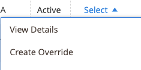
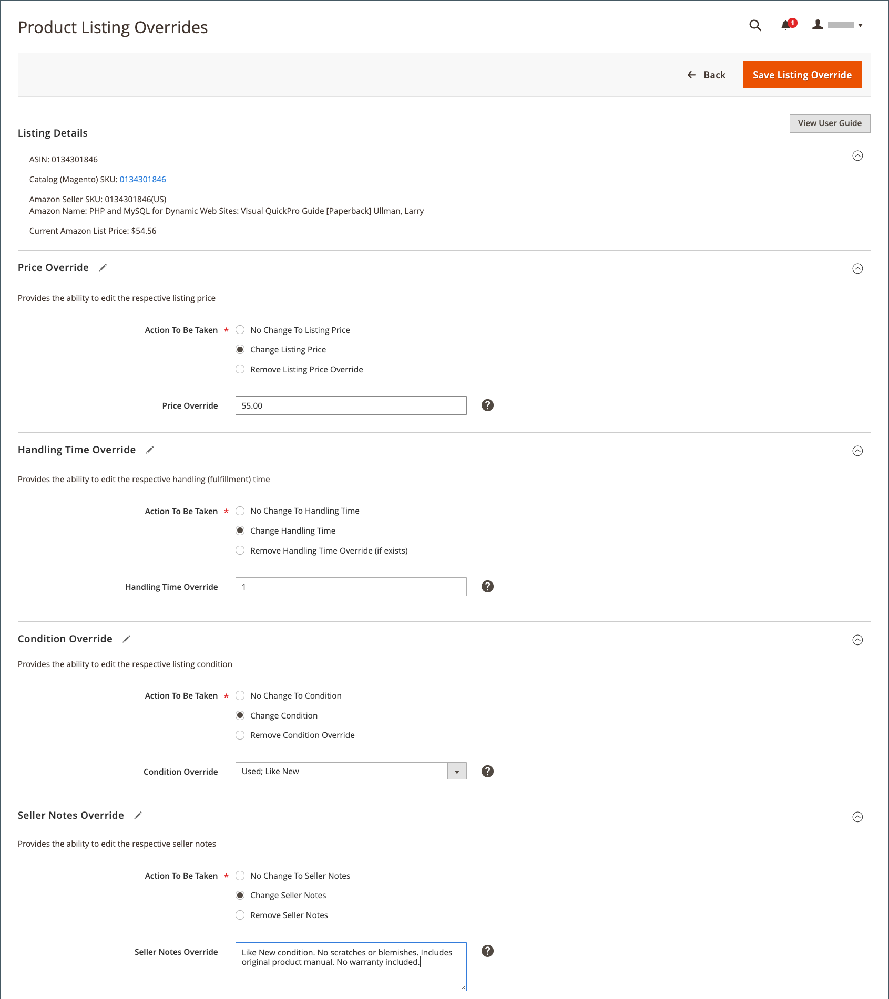

# Skapa och redigera åsidosättningar

Du kan skapa och åsidosätta en lista eller redigera eller ta bort en åsidosättning som har tillämpats på en lista. Åsidosätter anger ett definierat värde för en viss lista.

## Skapa en åsidosättning för en enstaka lista

The _[!UICONTROL Create Override]_är tillgänglig när du visar listor på_[!UICONTROL Inactive]_, _[!UICONTROL Active]_och_[!UICONTROL Ineligible]_ -tabbar.

1. Visa en lista på en _[!UICONTROL Products Listings]_sida (_[!UICONTROL Inactive]_, _[!UICONTROL Active]_och_[!UICONTROL Ineligible]_ -fliken).

1. I _[!UICONTROL Action]_kolumn, klicka **[!UICONTROL Select]**>**[!UICONTROL Create Override]**om du vill öppna sidan Åsidosättningar av produktlistor.

   

1. För att vara säker på att du visar rätt lista bör du kontrollera _[!UICONTROL Listing Details]_.

1. Bestäm vilken typ av åsidosättning du skapar.

   Du kan definiera en enskild åsidosättningstyp eller valfri kombination av typer för listan (Pris, Hanteringstid, Villkor, Seller Notes).

   - **Pris** - Klicka **[!UICONTROL Change Listing Price]** och ange ett definierat prisvärde för **[!UICONTROL Price Override]**.
   - **Hanteringstid** - Klicka **[!UICONTROL Change Handling Time]** och ange det definierade tidsvärdet (i dagar) för **[!UICONTROL Handling Time Override]**.
   - **Villkor** - Klicka **[!UICONTROL Change Condition]** och välj rätt alternativ för **[!UICONTROL Condition Override]**.
   - **Säljaranteckningar** - Klicka **[!UICONTROL Change Seller Notes]** och ange din anteckningstext för **[!UICONTROL Seller Notes Override]**.

1. Klicka **[!UICONTROL Save Listing Override]**.

   The _[!UICONTROL Product Listing Overrides]_sidan stängs. Listans status ändras till `Relist in Progress`. Ändringen kommer att publiceras till Amazon med nästa datasynkronisering (som konfigureras i cron-inställningarna). Listan läggs också till i_[!UICONTROL Overrides]_ -fliken.

I följande exempel visas en åsidosättning som definierar ett nytt pris på `$55`, en ny hanteringstid på `1 day`, ett nytt villkor för `Used; Like New`och ny text.

## Redigera eller ta bort en åsidosättning för en enstaka lista {#edit-override-single-listing}

The _[!UICONTROL Edit Overrides]_är tillgänglig när du visar listor på_[!UICONTROL Overrides]_ -fliken.

1. Visa en lista på _[!UICONTROL Product Listings]_sida (_[!UICONTROL Overrides]_ -fliken).

1. I _[!UICONTROL Action]_kolumn, klicka **[!UICONTROL Select]**>**[!UICONTROL Edit Overrides]**.

   The _[!UICONTROL Product Listing Overrides]_sidan öppnas.

   

1. För att vara säker på att du åsidosätter rätt lista bör du kontrollera _[!UICONTROL Listing Details]_.

1. Så här redigerar du _[!UICONTROL Override]_inställningar definierar du avsnitten för den typ som du vill ändra (Pris, Hanteringstid, Villkor, Seller Notes).

   Om du vill behålla samma typ av åsidosättning väljer du `No Change To <override type>` (standard). Med den här inställningen ändras inte det tidigare definierade åsidosättningsvärdet.

   - **Pris** - Klicka **[!UICONTROL Change Listing Price]** och ange ett definierat prisvärde för **[!UICONTROL Price Override]**.
   - **Hanteringstid** - Klicka **[!UICONTROL Change Handling Time]** och ange det definierade tidsvärdet (i dagar) för **[!UICONTROL Handling Time Override]**.
   - **Villkor** - Klicka **[!UICONTROL Change Condition]** och välj rätt alternativ för **[!UICONTROL Condition Override]**.
   - **Säljaranteckningar** - Klicka **[!UICONTROL Change Seller Notes]** och ange din anteckningstext för **[!UICONTROL Seller Notes Override]**.

1. Om du vill ta bort en åsidosättningstyp klickar du på **Ta bort** för varje typ som du vill ta bort. Om det inte tas bort finns det tidigare definierade värdet kvar i åsidosättningen.

1. Klicka **[!UICONTROL Save Listing Override]**.

   The _[!UICONTROL Product Listing Overrides]_sidan stängs. Listans status ändras till `Relist in Progress`. Ändringen kommer att publiceras till Amazon med nästa datasynkronisering (som konfigureras i cron-inställningarna). Om den inte redan finns med i listan läggs även listorna till i_[!UICONTROL Overrides]_ -fliken.

Piggybacking på _Skapa en åsidosättning_ exempel. I följande exempel visas en redigering av den tidigare skapade åsidosättningen som definierar det nya priset för `$50`, tar bort åsidosättningen av Hanteringstid och behåller de föregående villkors- och säljanteckningarna.

__

## Redigera eller ta bort en åsidosättning för flera listor {#edit-override-multiple-listings}

The _[!UICONTROL Edit Listing Overrides]_finns på_[!UICONTROL Inactive]_, _[!UICONTROL Active]_,_[!UICONTROL Overrides]_ och _[!UICONTROL Ineligible]_-tabbar.

>[!NOTE]
>
>Eftersom du ändrar åsidosättningar för flera listor visas _[!UICONTROL Listing Details]_-avsnittet visas inte på samma sätt som när du ändrar en enstaka lista.

1. Visa listan på en _[!UICONTROL Products Listings]_sida (_[!UICONTROL Inactive]_, _[!UICONTROL Active]_,_[!UICONTROL Overrides]_ och _[!UICONTROL Ineligible]_-fliken).

1. Markera kryssrutan i den vänstra kolumnen för varje lista som du vill ändra.

1. Under _[!UICONTROL Actions]_, klicka **[!UICONTROL Edit Listing Overrides]**.

   The _[!UICONTROL Product Listing Overrides]_sidan öppnas.

   

1. Så här redigerar du _[!UICONTROL Override]_inställningar definierar du avsnitten för den typ som du vill ändra (Pris, Hanteringstid, Villkor, Seller Notes).

   Om du vill att åsidosättningen ska vara densamma väljer du `No Change To <override type>` (standard). Med den här inställningen ändras inte det tidigare definierade åsidosättningsvärdet.

   - **Pris** - Klicka **[!UICONTROL Change Listing Price]** och ange ett definierat prisvärde för **[!UICONTROL Price Override]**.
   - **Hanteringstid** - Klicka **[!UICONTROL Change Handling Time]** och ange det definierade tidsvärdet (i dagar) för **[!UICONTROL Handling Time Override]**.
   - **Villkor** - Klicka **[!UICONTROL Change Condition]** och välj rätt alternativ för **[!UICONTROL Condition Override]**.
   - **Säljaranteckningar** - Klicka **[!UICONTROL Change Seller Notes]** och ange din anteckningstext för **[!UICONTROL Seller Notes Override]**.

1. Om du vill ta bort en åsidosättningstyp klickar du på **[!UICONTROL Remove]** för varje typ som du vill ta bort. Om det inte tas bort finns det tidigare definierade värdet kvar i åsidosättningen.

1. Klicka **[!UICONTROL Save Listing Override]**.

   The _[!UICONTROL Product Listing Overrides]_sidan stängs. Status för listorna ändras till `Relist in Progress`. Ändringen kommer att publiceras till Amazon med nästa datasynkronisering (som konfigureras i cron-inställningarna). Om den inte redan finns med i listan läggs även listorna till i_[!UICONTROL Overrides]_ -fliken.

### Åsidosättningstyper

| Åsidosätt | Beskrivning |
|--- |--- |
| [!UICONTROL Price Override] | En prisåsidosättning definierar priset för listorna. Åsidosättningen har högre prioritet än alla automatiska inställningar tills åsidosättningen tas bort.  Om du vill åsidosätta priset på din produkt väljer du **[!UICONTROL Change Listing Price]** och ange det nya priset för **[!UICONTROL Price Override]**. |
| [!UICONTROL Handling Time Override] | En åsidosättning av hanteringstid definierar den tid det tar (i dagar) att bearbeta och leverera produkter. Åsidosättning av hanteringstid har högre prioritet än alla automatiska inställningar och standardinställningar för hanteringstid tills åsidosättningen tas bort.  Värdet som finns i _[!UICONTROL Handling Time Override]_är antingen den standardhanteringstid som definieras i [listinställningar](./listing-settings.md) eller din definierade tid för åsidosättningshantering. Om du tar bort en åsidosättning av hanteringstid används som standard den hanteringstid som definieras i listinställningarna.  Om du vill definiera en åsidosättning av hanteringstid väljer du **[!UICONTROL Change Handling Time]**och ange den nya hanteringstiden (i dagar) för **[!UICONTROL Handling Time Override]**. |
| [!UICONTROL Condition Override] | Om du vill åsidosätta listvillkoren väljer du **[!UICONTROL Change Condition]** och välj det nya villkoret från **Åsidosätt villkor**. |
| [!UICONTROL Seller Notes Override] | För produkter i din katalog som har definierats med ett annat villkor än `New`, kan en säljaranteckning läggas till för att ytterligare beskriva din produkt och dess tillstånd för potentiella köpare. Du kan ange åsidosättning av en säljarfaktura för en `New` villkorsprodukten, men Amazon visar inte anteckningen.  Om du vill åsidosätta Seller Notes väljer du **[!UICONTROL Change Seller Notes]** och ange den nya anteckningen för **[!UICONTROL Seller Notes Override]**. |
