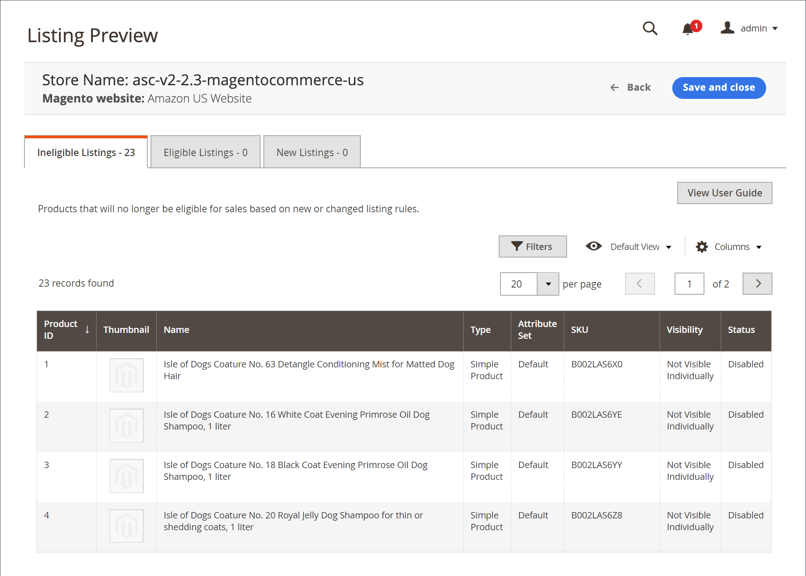

# [!UICONTROL Listing Rules]

Du kan komma åt listreglerna för butik i [instrumentpanel för butik](./amazon-store-dashboard.md).

Regler för att ta reda på vilka produkter som Amazon försäljningskanal publicerar till Amazon anges. Dessa regler innehåller många alternativ för att skapa enkla till komplexa regler som inkluderar eller exkluderar produkter som listor. Varje regel består av villkor som ställer in kraven för att få ta med en produktlista.

Dina listregler synkroniseras kontinuerligt med din [!DNL Commerce] katalog. När du lägger till nya [!DNL Commerce] produkter som uppfyller kraven i er lista bearbetas de automatiskt för notering på Amazon.

- Om du vill att alla dina produkter ska publiceras i en Amazon-lista ska du inte definiera några villkor för dina listregler.

- Om du vill begränsa vilka katalogprodukter som publiceras till Amazon definierar du villkoren för listreglerna. När du definierar villkoren för dina Amazon listregler följer du samma logik och process som när du definierar villkoren för [Kundprisregler](https://experienceleague.adobe.com/docs/commerce-admin/marketing/promotions/cart-rules/price-rules-cart.html).

- Om en produkt inte omfattas av din listningsregel ändras produktens kvalificeringsstatus till `Ineligible`. Ej berättigade produkter publiceras inte till Amazon.

- Om en produkt som inte uppfyller kraven redan finns i Amazon och du matchar Amazon lista med [!DNL Commerce] katalogprodukt, kvantiteten för Amazon-listan ändras till `0` för att förhindra försäljning av produkten. Amazon listor kan vara [manuellt borttagen](./end-listings-manually.md).

Ändringar av kvantitet och berättigandestatus påverkar alla listor som delar Amazon Seller SKU på marknadsplatser som säljer i samma region (enligt definitionen i _[!UICONTROL Amazon Marketplace Country]_under [butiksintegrering](./store-integration.md)). En ändring i en delad [!DNL Amazon Seller SKU] i en region påverkar inte produktens Amazon-listor i ett annat land.

{width="600" zoomable="yes"}

## Konfigurera inställningar för listregler

1. Klicka **[!UICONTROL Listing Rules]** på butikens kontrollpanel.

1. Ange villkor för vilka produkter som ska listas i Amazon.

Se [Exempel: Definiera ett villkor](./ob-define-condition-example.md).

| Fält | Beskrivning |
|-------------------------|---------------------------------------------------------------------------------------------------------------------------------------------------------------------------------------------------------------------------------------------------------------------------------------------------------------------------------------------------------------------------------------|
| [!UICONTROL Websites] | Vilka alternativ som är tillgängliga beror på [webbplatser](https://experienceleague.adobe.com/docs/commerce-admin/start/setup/websites-stores-views.html) du har konfigurerat i [!DNL Commerce] konfiguration. Välj webbplats för de produkter som ingår i Amazon. Det går bara att välja en webbplats eftersom varje webbplats kräver en unik Amazon-butik som skapats i Amazon försäljningskanal. |
| [!UICONTROL Conditions] | Används för att definiera [!DNL Commerce] attribut för produktberättigande i Amazon. Se [Exempel: Definiera ett villkor](./ob-define-condition-example.md). |

## Arbetsytan Villkor

Alla områden i villkoren som är feta kan klickas för att visa de olika alternativen.

- Lägg inte till villkor om alla produkter på de valda webbplatserna är berättigade.
- Det finns en komplex uppsättning back-end-processer för direktkommunikation med Amazon system. Beroende på hur många objekt du försöker lista och hur upptagna Amazon-system kan vara (t.ex. Black Friday) kan det ta tid för dina objekt att listas på Amazon.

Mer information om villkor finns i [Beskriv villkoren](https://experienceleague.adobe.com/docs/commerce-admin/marketing/promotions/cart-rules/price-rules-cart.html).

## Förhandsgranskning av listregel

När du ändrar villkorsdefinitionerna för dina listregler kan du klicka på **[!UICONTROL Preview Changes]** om du vill använda dina regeländringar och visa hur dina listor påverkas. Kontrollera dina listor i den här förhandsgranskningsfunktionen innan du sparar ändringarna i listregeln.

Dina Amazon-listor jämförs med dina regler och definierade villkor. Sedan kan du granska:

- Vilka produkter får en ogiltig status baserat på din nuvarande [!DNL Amazon Seller Central] konto
- Vilka produkter som går från ett icke-stödberättigande läge till en berättigande status
- Vilka produkter ingår i nya Amazon Listings och läggs till i din Amazon-lista från dina berättigade [!DNL Commerce] produkter

Med Förhandsgranska lista kan du förhandsgranska dina potentiella Amazon-listor och göra nödvändiga justeringar i dina listregler.

De potentiella Amazon-listorna finns på _[!UICONTROL Listing Preview]_sida på en av tre flikar:

- **[!UICONTROL Ineligible Listings]** - De listade produkterna kan inte tas upp i Amazon baserat på dina nuvarande regler och villkor.

  Ej berättigade produkter publiceras inte till Amazon. Om en produkt som inte uppfyller kraven redan finns i Amazon och du matchar Amazon lista med [!DNL Commerce] katalogprodukt, kvantiteten för Amazon-listan ändras till `0` för att förhindra försäljning av produkten. Information om hur du tar bort en lista manuellt finns i [Avslutar en Amazon-lista](./end-listings-manually.md). Produkter som inte uppfyller Amazon krav listas inte här. Dessa produkter är listade på [Fliken Inaktiva listor](./inactive-listings.md).

- **[!UICONTROL Eligible Listings]** - De listade produkterna kan komma i fråga för Amazon baserat på dina nuvarande regler och villkor och kan också komma i fråga enligt Amazon krav. Den här listan innehåller befintliga Amazon-listor som importeras (om du har **Importera tredjepartslistor** ange till `Import Listing` in [Listinställningar](./third-party-listing-settings.md)).

- **[!UICONTROL New Listings]** - produkterna i listan innehåller [!DNL Commerce] katalogprodukter som nyligen har tagits med i Amazon och som baseras på dina nuvarande regler och villkor samt skapa och publicera nya Amazon-listor.

### Visa förhandsgranskning av din lista

1. Klicka **[!UICONTROL Listing Rules]** på butikens kontrollpanel.

1. Visa eller lägg till [listregler](./listing-rules.md).

1. Ändra dina [Villkor för listregel](./ob-define-condition-example.md).

1. Klicka på **[!UICONTROL Preview Changes]**.

1. Granska och bekräfta dina listor i _[!UICONTROL Ineligible Listings]_,_[!UICONTROL Eligible Listings]_ och _[!UICONTROL New Listings]_-tabbar.

1. Om dina listor matchar dina förväntningar klickar du på **[!UICONTROL Save and close]**.

   Om listan inte visas som förväntat klickar du på **[!UICONTROL Back]** och ändra era regler och villkor tills era listor matchar era förväntningar.

{width="600" zoomable="yes"}

### Visar poster för förhandsgranskning

| Fält | Beskrivning |
|----------------------------|---------------------------------------------------------------------------------------------------------------------------------------------------------------------------------------------------------|
| [!UICONTROL Product ID] | Det unika, sekventiella numret som tilldelas till en [!DNL Commerce] katalogprodukt när den läggs till. |
| [!UICONTROL Thumbnail] | Visar en miniatyrbild av huvudproduktbilden. |
| [!UICONTROL Name] | Namnet på produkten som hanteras i [!DNL Commerce] [produktrutnät](https://experienceleague.adobe.com/docs/commerce-admin/catalog/products/products-list.html). |
| [!UICONTROL Type] | Typen av produkt som hanteras i [!DNL Commerce] produktrutnät. |
| [!UICONTROL Attribute Set] | Namnet på den attributuppsättning som används som mall för produkten, hanteras i [!DNL Commerce] produktrutnät. |
| [!UICONTROL SKU] | Den unika Stock Keeping-enheten som tilldelats produkten, hanteras i [!DNL Commerce] produktrutnät. |
| [!UICONTROL Visibility] | Anger var produkten är synlig, hanteras i [!DNL Commerce] produktrutnät. Alternativ:<ul><li>`Not visible individually`</li><li>`Catalog`</li><li>`Search`</li><li>`Catalog, Search`</li></ul> |
| Status | Anger status för produkten som hanteras i [!DNL Commerce] produktrutnät. Alternativ: `Enabled` / `Disabled` |

{width="500" zoomable="yes"}
