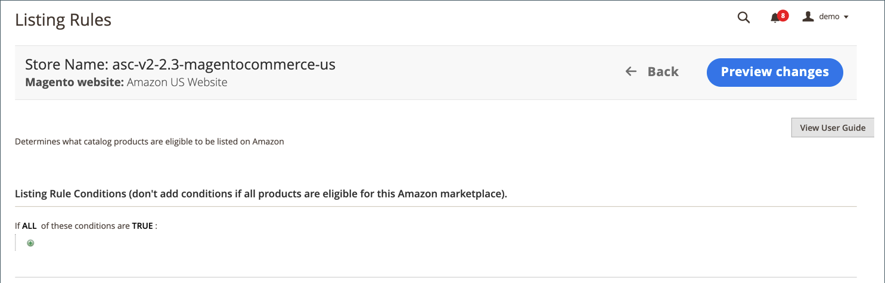

# Listregler

Du kan komma åt listreglerna för butik på [butikspanelen](./amazon-store-dashboard.md).

Regler för att ta reda på vilka produkter som Amazon försäljningskanal publicerar till Amazon anges. Dessa regler innehåller många alternativ för att skapa enkla till komplexa regler som inkluderar eller exkluderar produkter som listor. Varje regel består av villkor som ställer in kraven för att få ta med en produktlista.

Dina listregler synkroniseras kontinuerligt med din [!DNL Commerce]-katalog. När du lägger till nya [!DNL Commerce]-produkter som uppfyller behörighetskraven som anges i dina listregler bearbetas produkterna automatiskt för notering på Amazon.

- Om du vill att alla dina produkter ska publiceras i en Amazon-lista ska du inte definiera några villkor för dina listregler.

- Om du vill begränsa vilka katalogprodukter som publiceras till Amazon definierar du villkoren för listreglerna. När du definierar villkoren för dina Amazon listregler följer du samma logik och process som när du definierar villkoren för [kundprisregler](https://docs.magento.com/user-guide/marketing/price-rules-cart.html){target=&quot;_blank&quot;}.

- Om en produkt inte omfattas av listreglerna ändras produktens kvalificeringsstatus till `Ineligible`. Ej berättigade produkter publiceras inte till Amazon.

- Om en produkt som inte är berättigad redan finns med på Amazon och du matchar Amazon-listan med din [!DNL Commerce]-katalogprodukt, ändras antalet för Amazon-listan till `0` för att förhindra försäljning av produkten. Amazon-listor kan tas bort [manuellt](./end-listings-manually.md).

Ändringar av kvantitet och berättigandestatus påverkar alla listor som delar Amazon Seller SKU på marknadsplatser som finns för butiker som säljer i samma region (enligt definitionen i _[!UICONTROL Amazon Marketplace Country]_under [butiksintegrering](./store-integration.md)). En ändring av en delad [!DNL Amazon Seller SKU] i en region påverkar dock inte produktens Amazon-listor i ett annat land.

## Konfigurera inställningar för listregler

1. Klicka på **[!UICONTROL Listing Rules]** på butikens kontrollpanel.

1. Ange villkor för vilka produkter som ska listas i Amazon.

Se [Exempel: Definiera ett villkor](./ob-define-condition-example.md).

| Fält | Beskrivning |
|---|---|
| [!UICONTROL Websites] | Vilka alternativ som är tillgängliga beror på vilka [webbplatser](https://docs.magento.com/user-guide/stores/websites-stores-views.html){target=&quot;_blank&quot;} du har konfigurerat i din [!DNL Commerce]-konfiguration. Välj webbplats för de produkter som ingår i listan på Amazon. Det går bara att välja en webbplats eftersom varje webbplats kräver en unik Amazon-butik som skapats i Amazon försäljningskanal. |
| [!UICONTROL Conditions] | Används för att definiera [!DNL Commerce]-attributen för produktberättigande i din Amazon-region. Se [Exempel: Definiera ett villkor](./ob-define-condition-example.md). |

## Arbetsytan Villkor

Alla områden i villkoren som är feta kan klickas för att visa de olika alternativen.

- Lägg inte till villkor om alla produkter på de valda webbplatserna är berättigade.
- Det finns en komplex uppsättning back-end-processer som kommunicerar direkt med Amazon system. Beroende på hur många objekt du försöker lista och hur upptagna Amazon-system kan vara (t.ex. Black Friday) kan det ta tid för dina objekt att listas på Amazon.

Mer information om villkor finns i [Beskriv villkoren](https://docs.magento.com/user-guide/marketing/price-rules-cart.html){target=&quot;_blank&quot;}.

## Förhandsgranskning av listregel

När du ändrar dina villkorsdefinitioner för dina listregler kan du klicka på **[!UICONTROL Preview Changes]** för att tillämpa ändringarna och visa hur listorna påverkas. Kontrollera dina listor i den här förhandsgranskningsfunktionen innan du sparar ändringarna i listregeln.

Dina Amazon-listor jämförs med dina regler och definierade villkor. Sedan kan du granska:

- Vilka produkter som flyttas till en icke-giltig status baserat på ditt aktuella [!DNL Amazon Seller Central]-konto
- Vilka produkter som går från ett icke-stödberättigande läge till en berättigande status
- Vilka produkter ingår i nya Amazon Listings och läggs till i din Amazon-lista från dina [!DNL Commerce]-produkter

Med Förhandsgranska lista kan du förhandsgranska dina potentiella Amazon-listor och göra nödvändiga justeringar i dina listregler.

De potentiella Amazon-listorna visas på _[!UICONTROL Listing Preview]_-sidan på en av tre flikar:

- **[!UICONTROL Ineligible Listings]** - De listade produkterna kan inte tas upp i Amazon baserat på dina nuvarande regler och villkor.

   Ej berättigade produkter publiceras inte till Amazon. Om en produkt som inte är berättigad redan finns med på Amazon och du matchar Amazon-listan med din [!DNL Commerce]-katalogprodukt, ändras antalet för Amazon-listan till `0` för att förhindra försäljning av produkten. Mer information om hur du tar bort en lista manuellt finns i [Avsluta en Amazon-lista](./end-listings-manually.md). Produkter som inte uppfyller Amazon krav listas inte här. Dessa produkter listas på fliken [Inaktiva listor](./inactive-listings.md).

- **[!UICONTROL Eligible Listings]** - De listade produkterna kan komma i fråga för Amazon baserat på dina nuvarande regler och villkor och kan också komma i fråga enligt Amazon krav. Den här listan innehåller de befintliga Amazon-listor som importeras (om du har **Importera tredjepartslistor** inställda på `Import Listing` i [Listinställningar](./third-party-listing-settings.md)).

- **[!UICONTROL New Listings]** - De listade produkterna innehåller de  [!DNL Commerce] katalogprodukter som nyligen har tagits med i Amazon enligt de regler och villkor som gäller och skapar och publicerar nya listor från Amazon.

### Visa förhandsgranskning av din lista

1. Klicka på **[!UICONTROL Listing Rules]** på butikens kontrollpanel.

1. Visa eller lägg till dina [listregler](./listing-rules.md).

1. Ändra dina [villkor för listregel](./ob-define-condition-example.md).

1. Klicka på **[!UICONTROL Preview Changes]**.

1. Granska och bekräfta dina listor på flikarna _[!UICONTROL Ineligible Listings]_,_[!UICONTROL Eligible Listings]_ och _[!UICONTROL New Listings]_.

1. Om dina listor matchar dina förväntningar klickar du på **[!UICONTROL Save and close]**.

   Om dina listor inte visas som förväntat klickar du på **[!UICONTROL Back]** och ändrar reglerna och villkoren tills dina listor matchar dina förväntningar.

### Visar poster för förhandsgranskning

| Fält | Beskrivning |
|--- |--- |
| [!UICONTROL Product ID] | Det unika sekventiella nummer som tilldelas en [!DNL Commerce]-katalogprodukt när den läggs till. |
| [!UICONTROL Thumbnail] | Visar en miniatyrbild av huvudproduktbilden. |
| [!UICONTROL Name] | Namnet på produkten, som hanteras i [!DNL Commerce] [produktrutnätet](https://docs.magento.com/user-guide/catalog/products.html){target=&quot;_blank&quot;}. |
| [!UICONTROL Type] | Typen av produkt som hanteras i produktrutnätet [!DNL Commerce]. |
| [!UICONTROL Attribute Set] | Namnet på den attributuppsättning som används som mall för produkten, hanteras i produktstödrastret för [!DNL Commerce]. |
| [!UICONTROL SKU] | Den unika Stock Keeping Unit som är tilldelad produkten och hanteras i produktrutnätet [!DNL Commerce]. |
| [!UICONTROL Visibility] | Anger var produkten är synlig och hanteras i produktrutnätet [!DNL Commerce]. Alternativ:<ul><li>`Not visible individually`</li><li>`Catalog`</li><li>`Search`</li><li>`Catalog, Search`</li></ul> |
| Status | Anger produktens status, som hanteras i produktrutnätet [!DNL Commerce]. Alternativ: `Enabled` / `Disabled` |

