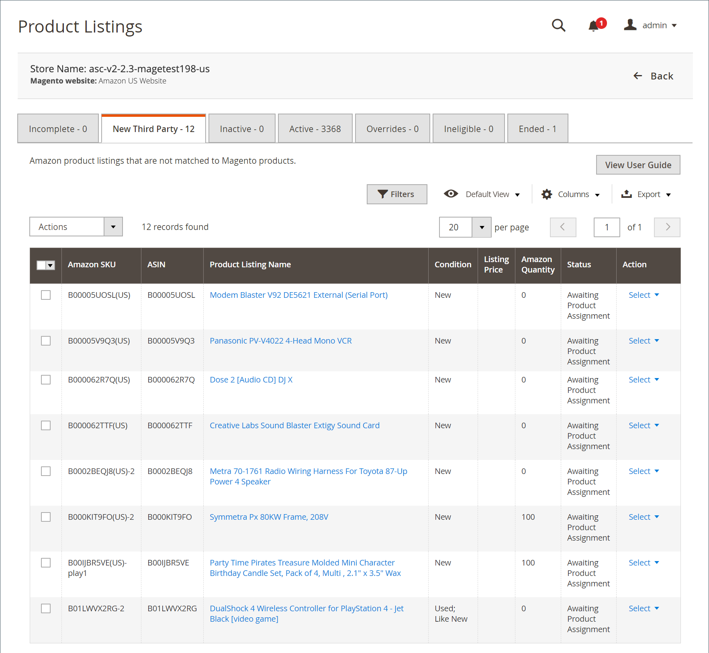

# Nya tredjepartslistor

På fliken _[!UICONTROL New Third Party]_visas dina befintliga Amazon-listor som inte har matchats mot en produkt i din [!DNL Commerce]-katalog. Om du vill använda listhantering för kvantitet, pris, hanteringstid och annat måste alla dina Amazon-listor matchas (tilldelas) till en produkt i din [!DNL Commerce]-katalog. Det finns några alternativ för att tilldela en produkt en lista i din [!DNL Commerce]-katalog.

Under _[!UICONTROL Actions]_:

- **[!UICONTROL Create New Catalog Product(s)]**: Använd informationen i Amazon lista för att automatiskt skapa en produkt i din  [!DNL Commerce] katalog. Den här processen matchar Amazon lista automatiskt med den nya katalogprodukten. Se [Skapa och tilldela katalogprodukter](./creating-assigning-catalog-products.md).

- **[!UICONTROL Attempt Automatic Match]**: Välj om du vill försöka matcha automatiskt de markerade listorna mot din katalog utifrån de aktuella  [katalogsökningsalternativen i ](./catalog-search.md) listinställningarna. Om du ändrar dina _[!UICONTROL Catalog Search]_-alternativ kan du med den här åtgärden försöka matcha processen igen.

Under _[!UICONTROL Select]_:

- **[!UICONTROL Assign Catalog Product]**: Välj om du vill matcha listan med en produkt i  [!DNL Commerce] katalogen manuellt. Se [Skapa och tilldela katalogprodukter](./creating-assigning-catalog-products.md).

- **[!UICONTROL Create New Catalog Product]**: Använd informationen i Amazon lista för att automatiskt skapa en produkt i din  [!DNL Commerce] katalog. Den här processen matchar Amazon lista automatiskt med den nya katalogprodukten. Se [Skapa och tilldela katalogprodukter](./creating-assigning-catalog-products.md).

- **[!UICONTROL View Details]**: Välj om du vill visa listinformation, inklusive  [listningsaktivitetsloggen](./product-listing-details.md#listing-activity-log),  [Buy Boxens konkurrentpriser](./product-listing-details.md#buy-box-competitor-pricing) och  [lägsta konkurrentpriser](./product-listing-details.md#lowest-competitor-pricing). Den här åtgärden är endast avsedd för visning. Inga ändringar kan göras i listinformationen. Se [Visa detaljer](./product-listing-details.md).

>[!NOTE]
>
>Om du har pågående listor visas ett meddelande ovanför flikarna som anger antalet listor.

Amazon hemsidor för försäljningskanaler har gemensamma [kontroller för arbetsytan](./workspace-controls.md) som gör att du kan anpassa de data som visas.

## Standardkolumner

| Kolumn | Beskrivning |
|---|---|
| [!UICONTROL Amazon Seller SKU] | SKU (Stock Keeping Unit) som Amazon har tilldelat en produkt för att identifiera produkt, alternativ, pris och tillverkare. |
| [!UICONTROL ASIN] | Ett unikt block med 10 bokstäver och/eller siffror som identifierar objekt.  ASIN står för  [!DNL Amazon Standard Identification Number]. Ett ASIN är ett unikt block med 10 bokstäver och/eller siffror som identifierar objekt. För böcker är ASIN samma som ISBN-numret, men för alla andra produkter skapas ett nytt ASIN när objektet överförs till deras katalog. Du hittar ett ASIN-objekt på produktinformationssidan på Amazon, tillsammans med mer information om artikeln. |
| [!UICONTROL Product Listing Name] | Produktens namn. |
| [!UICONTROL Condition] | Produktens [villkor](./product-listing-condition.md). |
| [!UICONTROL Listing Price] | Identifierar artikelns listpris, definierat av priskällan och eventuella tillämpliga prisregler. |
| [!UICONTROL Amazon Quantity] | Kvantiteten som är tillgänglig när produkten är aktivt listad på Amazon. |
| [!UICONTROL Status] | Status för listan, definierad av Amazon. |
| [!UICONTROL Action] | Lista över tillgängliga åtgärder som kan tillämpas på en viss lista. Om du vill använda en åtgärd klickar du på **[!UICONTROL Select]** i kolumnen _[!UICONTROL Action]_och väljer ett alternativ:<ul><li>[[!UICONTROL Assign Catalog Product]](./creating-assigning-catalog-products.md)</li><li>[[!UICONTROL Create New Catalog Product]](./creating-assigning-catalog-products.md)</li><li>[[!UICONTROL View Details]](./product-listing-details.md)</li></ul> |
