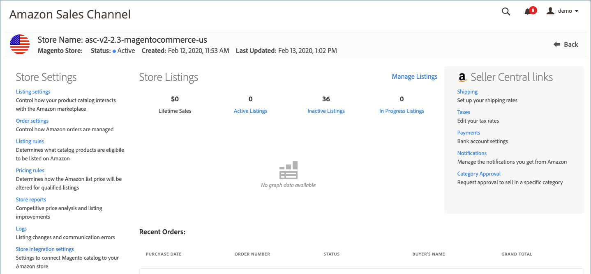

# Lagringsinställningar

När du har skapat och integrerat din Amazon-butik kan du kontrollera standardinställningarna för din butik och se till att din produkt, lista, priser och andra inställningar är korrekta.

1. Gå till **[!UICONTROL Marketing]** > _[!UICONTROL Channels]_>**[!UICONTROL Amazon Sales Channel]**på sidofältet_ Admin _.

1. Markera den butik som du vill visa och klicka på **[!UICONTROL View Store]**.

1. Klicka på en lagringsinställning på den vänstra menyn på butikspanelen.

   - [**[!UICONTROL Listing settings]**](./listing-settings.md) - Styr hur produktkatalogen interagerar med  [!DNL Amazon Marketplace].
   - [**[!UICONTROL Order settings]**](./order-settings.md) - Styr hur Amazon beställningar hanteras.
   - [**[!UICONTROL Listing rules]**](./listing-rules.md) - Definiera vilka katalogprodukter som kan listas i Amazon.
   - [**[!UICONTROL Pricing rules]**](./pricing-products.md) - Ange hur listpriset för Amazon ändras för kvalificerade listor.
   - **[!UICONTROL Store reports]** -  [Konkurrenskraftiga ](./competitive-price-analysis.md) prisanalyser och  [listförbättringar](./listing-improvements.md).
   - **[!UICONTROL Logs]** -  [Lista ](./listing-changes-log.md) ändringar och  [kommunikationsfel](./communication-errors-log.md).
   - [**[!UICONTROL Store integration setting]s **](./store-integration-settings.md)- Granska inställningarna för e-postmarknadsföring och Amazon-butiksnamn i  [!DNL Commerce] Admin.

