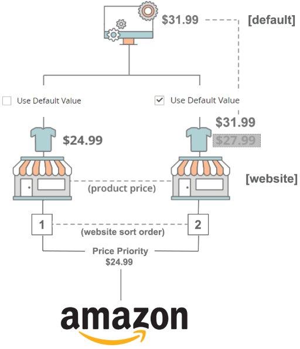

# Prioritetslogik

I följande exempel, hur avgör systemet om du ska publicera $31.99, $24.99 eller $27.99?

{width="400"}

Om du vill ta reda på vilket pris som används om en produkt finns på två webbplatser och har ett varierande pris per webbplats använder du prioritetslogik (som bestäms av värdet [Sorteringsordning](https://experienceleague.adobe.com/docs/commerce-admin/stores-sales/site-store/store-views.html)).

Om du vill visa sorteringsordningen för dina butiker går du till **[!UICONTROL Stores]** > **[!UICONTROL All Stores]** i sidofältet _Admin_. Klicka på webbplatsens namn i kolumnen _[!UICONTROL Web Site]_. På sidan_[!UICONTROL Web Site Information]_ visas inställningen _[!UICONTROL Sort Order]_för webbplatsen, vilket avgör webbplatsens prioritet. Värdet `1` anger den högsta prioriteten.

Om produktpriset är `Use Default` återgår det till standardpriset i stället för webbplatsens prisvärde.

## Exempel 1

|         | Webbplatsprioritet | Pris (webbplats) | Använd standard |
|---------|------------------|-----------------|-------------|
| Standard | 0 | 31,99 USD | — |
| Butik 1 | 1 | 24,99 USD | Nej |
| Butik 2 | 2 | 27,99 USD | Ja |

- **[!UICONTROL Magento Price Source]** (som definieras i ditt [listpris](./listing-price.md)) är inställt på attributet `Price`.
- Titta på webbplatsen med den högsta webbplatsprioriteten, som är Store 1 (definieras av värdet [Sorteringsordning](https://experienceleague.adobe.com/docs/commerce-admin/stores-sales/site-store/store-views.html)).
- Eftersom Store 1 är inställd på att använda webbplatspriset (Använd standard = Nej) är det publicerade priset $24,99.

## Exempel 2

|         | Webbplatsprioritet | Priswebbplats | Använd standard |
|---------|------------------|---------------|-------------|
| Standard | 0 | 31,99 USD | — |
| Butik 1 | 1 | 24,99 USD | Ja |
| Butik 2 | 2 | 27,99 USD | Nej |

- **[!UICONTROL Magento Price Source]** (som definieras i ditt [listpris](./listing-price.md)) är inställt på attributet `Price`.
- Titta på webbplatsen med den högsta webbplatsprioriteten, som är Store 1 (definieras av värdet för [sorteringsordning](https://experienceleague.adobe.com/docs/commerce-admin/stores-sales/site-store/store-views.html)).
- Eftersom Store 1 **inte är inställd på att använda webbplatspriset (Använd standard = Ja) kan du titta på nästa webbplats i sorteringsordningen.**
- Eftersom Store 2 **är** inställd på att använda webbplatspriset (Använd standard = Nej) är det publicerade priset 27,99 USD.

## Exempel 3

|         | Webbplatsprioritet | Priswebbplats | Använd standard |
|---------|------------------|---------------|-------------|
| Standard | 0 | 31,99 USD | 30,00 USD |
| Butik 1 | 1 | 24,99 USD | — |
| Butik 2 | 2 | 27,99 USD | $20.00 |

I det här exemplet läggs det icke-prisvärde som används om du väljer ett annat värde för _[!UICONTROL Magento Price Source_] (som definieras i inställningarna för [Listpris](./listing-price.md)). Icke-prisvärdet använder alltid pris som reservpris.

- **[!UICONTROL Magento Price Source]** (definieras i [[!UICONTROL Listing Price]](./listing-price.md)-inställningarna) är inställt på `Non-Price`.
- Titta på webbplatsen med den högsta webbplatsprioriteten, som är `Store 1` (definieras av värdet [Sorteringsordning](https://experienceleague.adobe.com/docs/commerce-admin/stores-sales/site-store/store-views.html)).
- Eftersom Store 1 **inte är inställd på att använda attributet `Non-Price` tittar du på nästa webbplats i sorteringsordningen.**
- Eftersom Store 2 **är** inställd på att använda attributet `Non-Price` (Non-Price [Website] = $20.00) är det publicerade priset $20.00.
