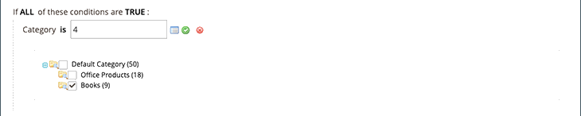
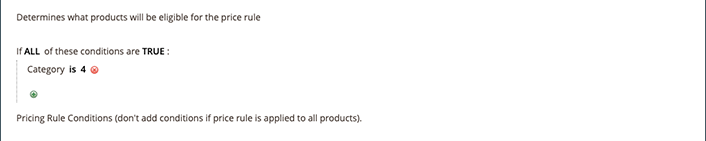

# Villkor för prisregel

Villkoren avgör vilka produkter som omfattas av prisregeln. När du definierar villkoren för dina Amazon-prisregler följer du samma logik och process som när du definierar villkoren för [Kundprisregler](https://docs.magento.com/user-guide/marketing/price-rules-cart.html){target="_blank"} in [!DNL Commerce].

>[!IMPORTANT]
>
>Om prisregeln gäller för alla produkter i [!DNL Commerce] och lämna sedan avsnittet tomt.

Alla områden i villkoren som är feta kan klickas för att visa de olika alternativen.

## Exempel: skapa ett prisregelvillkor

Den här processen kan vara enkel eller detaljerad, beroende på katalogkonfigurationen. Du kan definiera villkor så att när `ALL` eller `ANY` av villkoren antingen `TRUE` eller `FALSE` för en produkt är produkten berättigad till prissättningsregeln.

Villkoren baseras på dina [produktattribut](https://docs.magento.com/user-guide/catalog/product-attributes.html){target="_blank"}. Om du vill tillämpa regeln på alla produkter lämnar du villkorsavsnittet tomt.

>[!NOTE]
>
>Om du vill definiera ett villkor baserat på ett visst produktattribut, **Använd för villkor för kampanjregel** för attributet måste anges till `Yes` i [Egenskaper för Storefront](https://docs.magento.com/user-guide/stores/attribute-product-create.html){target="_blank"} för attributet.

I det här exemplet definieras en regel som tillämpar en rabatt på 25 % på alla produkter som definieras i `Books` kategori.

Programsatsen rule har två feta länkar som, när de klickas, visar alternativen för den delen av villkorssatsen. Om du sparar villkoret utan att ändra ett fetstil, gäller regeln alla dina produkter.

- Klicka **[!UICONTROL ALL]** och välj antingen `ALL` eller `ANY`.
- Klicka **[!UICONTROL TRUE]** och väljer antingen `TRUE` eller `FALSE`.
- Om du vill tillämpa regeln på alla produkter låter du villkoret vara oförändrat.

Du kan skapa olika villkor genom att ändra kombinationen av dessa värden. I det här exemplet används följande villkor:

`If ALL of these conditions are TRUE:`

1. Om du vill visa tillgängliga attribut som villkoret gäller för klickar du på Lägg till () i början av villkorslinjen och väljer ett attribut som villkoret ska baseras på.

   **[!UICONTROL Conditions Combination]** - Välj om du vill skapa en annan uppsättning `All/Any` och `True/False` villkor inuti det befintliga villkoret.

   

   **[!UICONTROL Product Attribute]** - De tillgängliga produktattributen beror på [inställning av attributet](https://docs.magento.com/user-guide/stores/attribute-product-create.html){target="_blank"}. For an attribute to show in the list, *[!UICONTROL Use for Promo Rule Conditions]* for the attribute must be set to `Yes` in your [storefront properties](https://docs.magento.com/user-guide/stores/attribute-product-create.html){target="_blank"}.

   - För **[!UICONTROL Product Attribute]** väljer du det attribut som du vill definiera som bas för villkoret. I det här exemplet är det markerade villkoret `Category`.

      

      Det markerade villkoret visas i programsatsen, följt av ytterligare två feta länkar. Alternativen varierar beroende på vilket produktattribut du väljer.

      När du har angett attributet kan det inte redigeras. Om du vill ändra attributet måste du ta bort raden och lägga till det nya attributet. Du kan ta bort en villkorslinje genom att klicka på Ta bort ( ikonen i slutet av raden.

   - Klicka **[!UICONTROL is]** och välj den jämförelseoperator som beskriver villkoren för att produkterna ska uppfylla villkoren.

      I det här exemplet är jämförelseoperatorn `is`. Vilka alternativ som är tillgängliga beror på vilket attribut du valde i föregående steg och kan innehålla olika jämförelsealternativ. Alternativen kan innehålla matchande värden, som inte inkluderar eller innehåller minst ett av värdena, och större än, lika med och mindre än ett numeriskt värde. I det här exemplet är alternativen `is` och `is not`.

   - Klicka **[!UICONTROL ...]** och välj det attributvärde som villkoret baseras på. Alternativen beror på attributets inställning.

      Du kan uppmanas att välja ett alternativ eller ange ett värde för villkoret. I det här exemplet visas fältet tomt. Om du vill välja kategori(er) för regeln klickar du på väljarikonen () för att visa dina markeringsalternativ. Den här regeln gäller för _Böcker_ väljer du **[!UICONTROL Books]** kryssrutan. Kategorinumret fylls i. Klicka på den gröna bockmarkeringsikonen ().

      

      Det markerade objektet visas i satsen för att slutföra villkoret.

      

      Detta exempelvillkor är klart. Detta innebär, som sagt, att alla produkter i [!DNL Commerce] katalog som har en definierad kategori med böcker (`4`) omfattas av denna prisregel. Du kan lägga till fler villkorslinjer för att ytterligare begränsa vilka produkter som omfattas.

1. Om du vill lägga till ytterligare en villkorslinje till satsen går du tillbaka till steg 1 och upprepar processen tills alla önskade villkor är klara.

   Du kan när som helst ta bort en rad i villkorssatsen genom att klicka på Ta bort () i slutet av raden.
