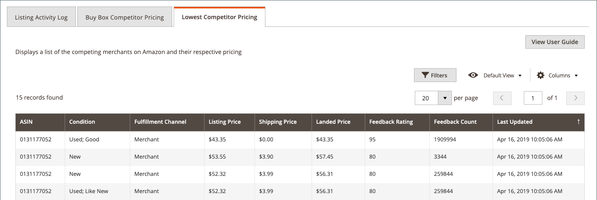

# Visa listinformation

The _[!UICONTROL Product Listing Details]_på sidan visas ytterligare information om din aktiva produktlista, inklusive aktivitetsloggen för listning som visar ändringarna för en enskild SKU/produkt. Denna information kan hjälpa er att förstå konkurrensstatistik för era produkter och om individuella SKU-/produktförändringar. Ytterligare information på denna sida omfattar:

- **[!UICONTROL Listing Details]** - Produktinformation inklusive namn och Amazon Seller SKU
- **[!UICONTROL Listing Activity Log]** - Historiskt register över alla ändringar som har gjorts för den här förteckningen, t.ex. priser och kvantitet/lagerförändringar. Inga fler åtgärder krävs. Den här loggen finns för granskning för att förstå ändringshistoriken.
- **[!UICONTROL Buy Box Competitor Pricing]** - Data för Amazon [[!DNL Buy Box]](./buy-box-competitor-pricing.md) status och konkurrentpriser
- **[!UICONTROL Lowest Competitor Pricing]** - Information om de lägsta Amazon-konkurrenternas priser och feedback

Amazon hemsidor för försäljningskanaler delar några vanliga sidor [arbetsytekontroller](./workspace-controls.md) som gör att du kan anpassa de data som visas.

## Listinformation

Den produktinformation som visas omfattar:

- _[!UICONTROL Amazon Name]_
- _[!UICONTROL Catalog (Magento) SKU]_
- _[!UICONTROL Amazon Seller SKU]_

## Logg för listningsaktivitet {#listing-activity-log}

Visar alla senaste aktiviteter för Amazon-listan. Följande information visas:

- Amazon Seller SKU: Identifierar den SKU (Stock Keeping Unit) som är definierad för förteckningen.
- ASIN: Identifierar den 10-siffriga Amazon-produktidentifieraren.
- Liståtgärd: Identifierar typen av åtgärd som inträffade för listan.
- Kommentarer: Ger ytterligare information om vilken typ av liståtgärd som har utförts.
- Körd: Identifierar datum och tid då åtgärden utfördes.

__

## Buy Boxens konkurrentpriser {#buy-box-competitor-pricing}

På den här fliken visas information om den Amazon-handlare som har [[!DNL Buy Box]](./buy-box-competitor-pricing.md) positionen för noteringen. Denna information kan användas för att förstå prisplaceringen för dina konkurrenter på Amazon. Följande information visas:

- ASIN: Den 10-siffriga Amazon-produktidentifieraren.
- Är säljare: Identifierar om du är [!DNL Buy Box] säljare. Alternativ Ja/Nej.
- Villkor: Identifierar det villkor som definierats för listan.
- Listpris: Identifierar det pris som användes för att publicera noteringen.
- Leveranspris: Identifierar det leveranspris som lagts till i listan.
- Lanserat pris: Identifierar listpriset plus leveranspriset för noteringen.
- Senast uppdaterad: Identifierar datum och tid då prisinformationen uppdaterades från Amazon.

## Lägsta konkurrentpris {#lowest-competitor-pricing}

På den här fliken visas information om Amazon konkurrenter för samma lista. Den här informationen kan användas för att förstå prispositionering och [lägsta konkurrentpris](./lowest-competitor-pricing.md). Följande information visas:

- ASIN: Den 10-siffriga Amazon-produktidentifieraren.
- Villkor: Identifierar det villkor som definierats för listan.
- Fulfillment Channel: Identifierar den part som är ansvarig för uppfyllandet. Alternativ: Merchant/Amazon.
- Listpris: Identifierar det pris som användes för att publicera noteringen.
- Leveranspris: Identifierar det leveranspris som lagts till i listan.
- Lanserat pris: Identifierar listpriset plus leveranspriset för noteringen.
- Feedback-klassificering: Identifierar Amazon feedback-klassificering för den lägsta handlaren.
- Antal feedback: Identifierar Amazon feedback-antal för den lägsta återförsäljaren.
- Senast uppdaterad: Identifierar datum och tid då prisinformationen uppdaterades från Amazon.

