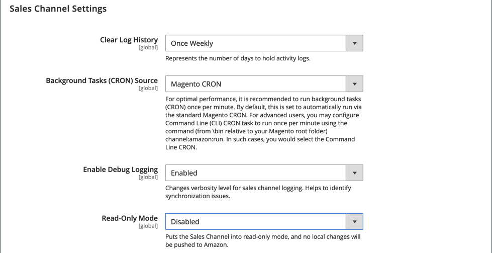

# Inställningar för Sales Channel

När tillägget [!DNL Amazon Sales Channel] är installerat anges standardvärden i Admin for Amazon-försäljningskanalen. De här inställningarna kan ändras i konfigurationsinställningarna för din Amazon Store. Dessa inställningar inkluderar:

- Intervall för rensning av aktivitetslogghistorik
- Källval för kron
- Alternativ för loggsynkronisering

## Ändra inställningarna för handelskanaler

1. Gå till **[!UICONTROL Stores]** > _[!UICONTROL Settings]_>**[!UICONTROL Configuration]**på sidofältet_ Admin _.

1. Expandera **[!UICONTROL Sales Channels]** i den vänstra panelen och välj **[!UICONTROL Global Settings]**.

1. Välj ett alternativ för **[!UICONTROL Clear Log History]**:

   - `Once Daily` - Välj att rensa din butiksaktivitetshistorik en gång om dagen.

   - `Once Weekly` - Välj att rensa din butiksaktivitetshistorik en gång i veckan.

   - `Once Monthly` - (Standard) Välj att rensa din butiksaktivitetshistorik en gång i månaden.

1. Välj `Magento CRON` för **[!UICONTROL Background Tasks (CRON) Source]**.

   Med det här alternativet kan Amazon försäljningskanal använda dina [!DNL Commerce] [Cron](https://docs.magento.com/user-guide/system/cron.html)-inställningar för att fastställa kommunikations- och datasynkroniseringsintervall med [!DNL Amazon Seller Central].

1. För **[!UICONTROL Enable Debug Logging]** väljer du `Enabled` om du vill samla in ytterligare synkroniseringsdata när felsökning behövs.

   Loggning av Amazon-försäljningskanal skrivs till `{Commerce Root}/var/log/channel_amazon.log`-filen och kan visas i [utvecklarläge](https://docs.magento.com/user-guide/magento/installation-modes.html){:target=&quot;_blank&quot;}. Loggning ska endast vara `Enabled` under felsökning och ska vara `Disabled` när felsökningen är klar.

1. Klicka på **[!UICONTROL Save Config]**.

