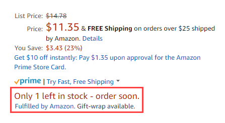

# [!UICONTROL Stock/Quantity]

*[!UICONTROL Stock/Quantity]* -inställningarna ingår i inställningarna för din butikslista. Du kommer åt listinställningarna via [instrumentpanel för butik](./amazon-store-dashboard.md).

De här inställningarna används för att synkronisera produktkvantitetsinformation från din [!DNL Commerce] butiken till kvantiteten på [!DNL Amazon Seller Central] konto. Det här verktyget är kraftfullt och kan användas för ytterligare annonsering genom att visa köparens snabbhet samtidigt som lagret hålls organiserat. En del handlare kan till exempel ha 150 artiklar av en viss SKU i lager och vill vara säkra på att Amazon kunder kan köpa hela sitt lager. Andra handlare kanske bara vill ta med ett objekt i taget för att skapa en känsla av brist för slutanvändaren. I det här fallet anger du *[!UICONTROL Maximum Listed Quantity]* till `1`.

Kvantitet är ett regionalt attribut och baseras på **[!UICONTROL Amazon Marketplace Country]** inställning definiera under [butiksintegrering](./store-integration.md). När en ändring görs av en produkts kvantitet påverkar ändringen alla Amazon-listor som delar den [!DNL Amazon Seller SKU] i Amazon butiker som säljer i samma land. Ändra till en delad [!DNL Amazon Seller SKU] i USA påverkar inte dina Amazon-butiker som har konfigurerats för ett annat land. Din första Amazon-butik som är integrerad (med det äldsta skapandedatumet) styr prioriteten i kvantitetsinställningarna.

>[!NOTE]
>
>För användare av Adobe Commerce och Magento Open Source 2.3.x stöder Amazon försäljningskanal användning av Inventory management-tillägget utan ytterligare konfiguration. Se [Hantera lager](https://docs.magento.com/user-guide/v2.3/catalog/inventory-management.html){target="_blank"}.

## Konfigurera inställningar för lager/kvantitet {#configure-stock--quantity-settings}

1. Klicka **[!UICONTROL Listing Settings]** på butikens kontrollpanel.

1. Expandera avsnittet **[!UICONTROL Stock / Quantity]**.

1. För **[!UICONTROL Out-of-Stock Threshold]** (obligatoriskt), ange ett numeriskt värde för den lägsta kvantiteten av en produkt för att produkten ska kunna tas upp i förteckningen över Amazon.

   Standardvärdet är `0`. Om [!DNL Commerce] Produkten blir mindre än detta nummer, respektive Amazon-lista är inte tillgänglig för försäljning via Amazon.

1. För **[!UICONTROL Maximum Listed Quantity]** (obligatoriskt) anger du ett numeriskt värde för den kvantitet du vill visa i din Amazon-lista.

   Den här inställningen visar alla Amazon-listor som är berättigade till det angivna värdet. När en artikel säljs ändras inte Amazon listkvantitet. Den tillgängliga kvantiteten i listan använder alltid det här värdet, även när den faktiska produktkvantiteten är högre eller lägre. Den här inställningen används vanligtvis när du inte hanterar produktlager. Du kan till exempel ha en produkt med en kvantitet på 80 i [!DNL Commerce] katalog. Med inställningen `10`visas alltid den tillgängliga kvantiteten `10` och ändras inte när produkten säljs.

1. För **[!UICONTROL "Do Not Manage Stock" Quantity]** (obligatoriskt) anger du ett kvantitetsvärde som ska visas för dina Amazon-listor.

   Amazon kräver att du publicerar en tillgänglig kvantitet. För [!DNL Commerce] produkter som inte är inställda på att hantera stockar men som du vill visa på Amazon, publiceras listan med den tillgängliga kvantitet som anges här.

1. När du är klar klickar du på **[!UICONTROL Save listing settings]**.

{width="600" zoomable="yes"}

| Fält | Beskrivning |
|---------------------------------------------|--------------------------------------------------------------------------------------------------------------------------------------------------------------------------------------------------------------------------------------------------------------------------------------------------------------------------------------------------------------------------------------------------------------------------------------------------------------------------------------------------------------------------------------------------------------------------------------------------|
| [!UICONTROL Out-of-Stock Threshold] | Ange ett numeriskt värde för den lägsta kvantiteten av en produkt för att produkten ska kunna tas upp i Amazon (standardvärdet är `0`).  Om [!DNL Commerce] Produkten blir mindre än detta nummer, respektive Amazon-lista är inte tillgänglig för försäljning via Amazon. |
| [!UICONTROL Maximum Listed Quantity] | Ange ett numeriskt värde för den kvantitet du vill visa i din Amazon-lista.  När en artikel säljs återpubliceras den kvantitet som anges här. Den här inställningen används vanligtvis när du inte hanterar produktlager.  Du kan t.ex. ange värdet för Högsta antal listade antal som `10`. Din faktiska kvantitet för en produkt är `80`. Eftersom du har angett det här värdet till `10`visas alltid den tillgängliga kvantiteten `10`. Tillgänglig kvantitet visas alltid med det definierade värdet, även när lagerkvantiteten är lägre. |
| [!UICONTROL "Do Not Manage Stock" Quantity] | Ange ett värde för visningsmängden för dina Amazon-listor.  Amazon kräver att du publicerar en tillgänglig kvantitet. För [!DNL Commerce] produkter som inte är inställda på att hantera stockar men som du vill visa en lista på Amazon, publiceras listan med den tillgängliga kvantiteten av värdet som anges här. |

**Snabb åtkomst** - [!UICONTROL Listing Settings] avsnitt

- [[!UICONTROL Product Listing Actions]](./product-listing-actions.md)
- [[!UICONTROL Third Party Listings]](./third-party-listing-settings.md)
- [[!UICONTROL Listing Price]](./listing-price.md)
- [[!UICONTROL (B2B) Business Price]](./business-pricing.md)
- [[!UICONTROL Stock / Quantity]](./stock-quantity.md)
- [[!UICONTROL Fulfilled By]](./fulfilled-by.md)
- [[!UICONTROL Catalog Search]](./catalog-search.md)
- [[!UICONTROL Product Listing Condition]](./product-listing-condition.md)

## Exempel: Maximal listat kvantitet

När en artikel säljs är den här kvantiteten försedd med Amazon lista.

Om du till exempel anger *[!UICONTROL Maximum Listed Quantity]* as `12`, visas i Amazon lista 12 trots att produkten har en [!DNL Commerce] Kvantitet av 80:

{width="300"}

Om du ställer in *[!UICONTROL Maximum Listed Quantity]* as `1`, listas alla produkter med en kvantitet `1`. När en artikel säljs ser systemet ut som [!DNL Commerce] produkten och, om det finns ytterligare lager, är den i Amazon försedd med en kvantitet `1`.

Det här alternativet kan vara värdefullt för produkter som vanligtvis beställs med en kvantitet på 1. Det är också mycket angeläget för kunderna när de tittar på din Amazon-lista.

{width="300"}
