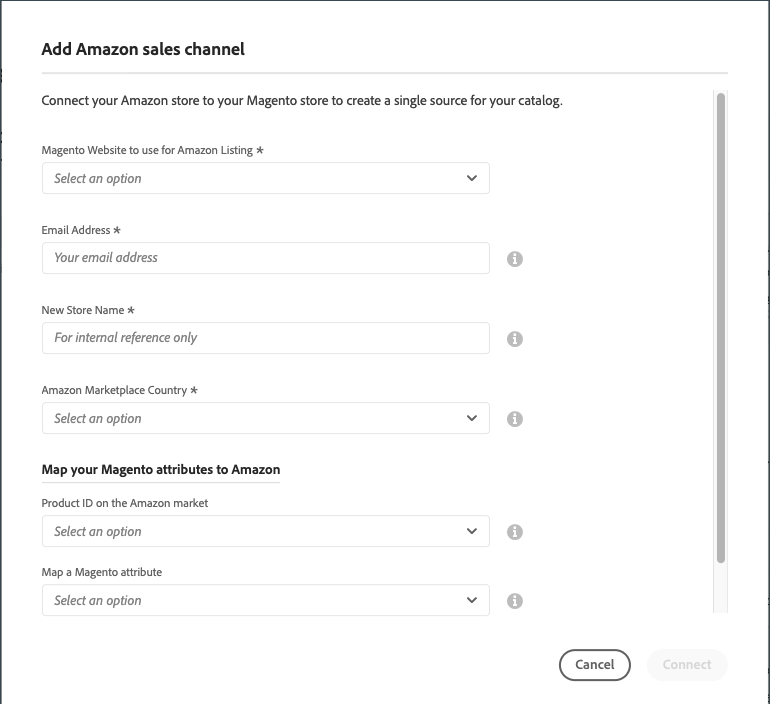

# Integrering med en [!DNL Amazon Seller Account]

Om du vill komma igång med Amazon försäljningskanal måste du skapa (lägga till) en Amazon försäljningskanalbutik och ansluta den till din [!DNL Amazon Seller Account]. Dessa två steg integrerar [!DNL Commerce] och Amazon-konton för att dela data, synkronisera produkter med mera.

_Du behöver de primära inloggningsuppgifterna för din [!DNL Amazon Seller Central] konto (den e-postadress eller telefon som används för att skapa säljarkontot) för att ansluta butiken._

>[!NOTE]
>
>När du har integrerat din första butik uppmanas du att förnya din Amazon-anslutning till Amazon varje år genom att bevilja åtkomst igen. Du kan förnya eller återkalla auktoriseringen i dialogrutan _Aktuella auktoriseringar_ tabellen i _Amazon MWS Developer Permissions_ i **Inställningar** > **Användarbehörigheter** sidan för ditt Seller Central-konto.

## Lägg till en Amazon-butik

1. På _Administratör_ sidebar, gå till **Marknadsföring** > _Kanaler_ > **Amazon Sales Channel**.

   När du lägger till din första Amazon-butik _Åtgärder före installation_ modal visas. När din första butik har lagts till kan du få åtkomst till förinställningsuppgifterna på [Amazon säljkanal - startsida](./amazon-sales-channel-home.md) sida under _Utbildning och förberedelser_ i den vänstra menyn.

1. Klicka **[!UICONTROL Add Amazon Store]**.

   The _[!UICONTROL Add Amazon sales channel]_sidan öppnas.

   {width="500" zoomable="yes"}

1. För **[!UICONTROL Magento Website to use for Amazon Listing]** väljer du vilken av dina [!DNL Commerce] webbplatser att ansluta till denna Amazon-återförsäljarkanalbutik.

   Den här inställningen definierar också standardinställningen [!DNL Commerce] lagra för [importera Amazon-order](./order-settings.md).

1. För **[!UICONTROL Email Address]** anger du din e-postadress till kontaktpersonen.

1. För **[!UICONTROL New Store Name]** anger du ett beskrivande namn för din nya Amazon-butik.

   >[!NOTE]
   >
   >Det här namnet används som [!DNL Commerce] bara referera till och identifierar arkivet på [Amazon säljkanal - startsida](./amazon-sales-channel-home.md) sida. Ni vill göra det till något som teamet lätt kan identifiera. Din Amazon-butik som säljer i USA kan till exempel heta `Amazon Store USA`.

1. För **[!UICONTROL Amazon Marketplace Country]** väljer du den region/det land där den här Amazon-säljkanalsbutiken säljer produkter. Alternativ:

   - Amerikas förenta stater
   - Kanada
   - Mexico
   - Storbritannien

1. I _[!UICONTROL Map your Magento attributes to Amazon]_gör du följande:

   - För **[!UICONTROL Product ID on the Amazon market]** väljer du det Amazon-attribut som ska mappas till [!DNL Commerce] attribut valt nedan.

      Detta ID hjälper dig att matcha motsvarande produkter i din [!DNL Commerce] katalog.

   - För **[!UICONTROL Map a Magento attribute]** väljer du [!DNL Commerce] produktattribut att mappa till det Amazon-attribut som valts ovan.

      [Mappningsattribut](./ob-creating-magento-attributes.md) hjälper dig att se till att din Amazon-lista matchar motsvarande produkt i din [!DNL Commerce] katalog.

1. Klicka **[!UICONTROL Connect]**.

   Dialogrutan stängs och den nya butiken visas på [Amazon säljkanal - startsida](./amazon-sales-channel-home.md) sida med ett bekräftelsemeddelande.

## Anslut en butik till [!DNL Amazon Seller Central]

1. Klicka på **[!UICONTROL Connect store]** på butikskortet att starta [!DNL Amazon Seller Central] på en ny flik.

1. Ange [!DNL Amazon Seller Central] kontoinloggningsuppgifter och klicka på **[!UICONTROL Sign in]**.

   Du måste logga in på din [!DNL Amazon Seller Central] konto med inloggningsuppgifterna för den primära användaren (den e-postadress eller telefon som användes för att skapa säljarkontot).

1. Fyll i Amazon Two-Factor Authorization (2FA) genom att ange koden du får från Amazon och klicka på **[!UICONTROL Sign in]**.

1. På _[!UICONTROL Amazon Marketplace Web Service]_bekräftelsesida väljer du[!UICONTROL I understand...]&quot; och klicka **[!UICONTROL Next]**.

1. På _[!UICONTROL You are almost done]_meddelande, klicka **[!UICONTROL Continue]**.

   Du har gett Amazon försäljningskanal behörighet att komma åt och dela data med din [!DNL Amazon Seller Central] konto. Amazon-sidan stängs och ett bekräftelsemeddelande visas.

   The [Amazon säljkanal - startsida](./amazon-sales-channel-home.md) öppnas en sida med dina Amazon Store-kort.

   Om du vill visa kontrollpanelen för butiker klickar du på **[!UICONTROL View Store]** på butikskortet.

{width="600" zoomable="yes"}

Din nya Amazon-butik är nu ansluten till din [!DNL Amazon Seller Central] konto.

 [**Fortsätt skapa en listregel**](./ob-create-listing-rule.md)
