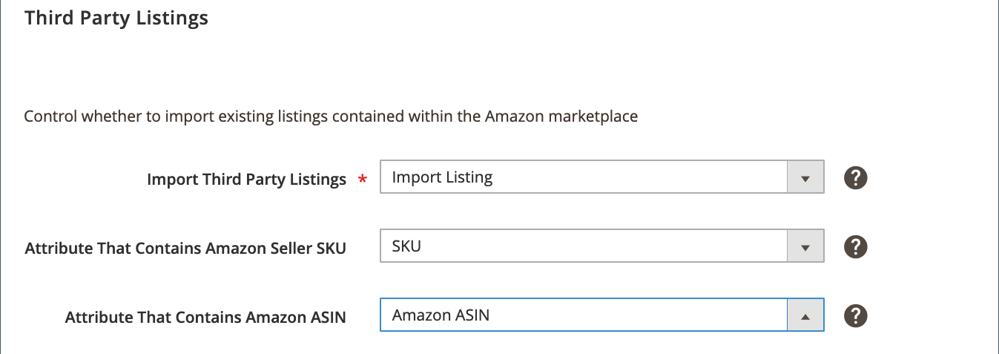

# [!UICONTROL Third-party Listings]

Inställningarna för tredjepartslistan ingår i inställningarna för din butikslista. Du kommer åt listinställningarna från [butiksinstrumentpanelen](./amazon-store-dashboard.md).

De här inställningarna avgör om din [!DNL Commerce]-katalog importerar produkter från dina befintliga [!DNL Amazon Seller Central]-listor. Det är en god vana att importera listor från Amazon för att se till att alla listor har matchande [!DNL Commerce]-produkter. När dina listor är en del av din [!DNL Commerce]-katalog kan du hantera alla dina produkter från en enda katalog och använda funktionerna i Amazon försäljningskanal. Bland dessa funktioner märks orderhantering med Amazon, intelligent prissättning och kvantitetshantering.

När du konfigurerar att importera dina Amazon-listor importerar Amazon-försäljningskanal dina Amazon-listor till din [!DNL Commerce]-katalog och försöker matcha dem med befintliga produkter. Om ingen matchning hittas automatiskt kan du importera Amazon-listan som en ny [!DNL Commerce]-produkt eller manuellt matcha listan med en produkt.

Om du väljer att importera dina Amazon-listor väljer du attributen [!DNL Commerce] med värden för Amazon Seller SKU och Amazon ASIN. Om du inte har [!DNL Commerce] [produktattribut](./ob-creating-magento-attributes.md) kan du skapa och tilldela dem. Genom att mappa dessa attribut kan du matcha importerade Amazon-listor korrekt med dina [!DNL Commerce]-produkter.

Den inledande listimporten initieras när [butiksintegreringen](./store-integration.md) är klar. Efteråt och baserat på dina cron-inställningar söker [!DNL Commerce] kontinuerligt efter nyligen tillagda Amazon-listor (som inte har skapats i Amazon Sales Channel) och uppdaterar [!DNL Commerce] -katalogen enligt inställningarna för tredjepartslistor.

## Konfigurera inställningar för tredjepartslistor

1. Klicka på **[!UICONTROL Listing Settings]** på butikens kontrollpanel.

1. Expandera avsnittet _[!UICONTROL Third Party Listings]_.

1. Välj ett alternativ för **[!UICONTROL Import Third Party Listings]** (obligatoriskt):

   - `Import Listing` - (Standard) Välj när du vill att produktinformation från dina Amazon-listor ska importeras till din [!DNL Commerce]-produktkatalog. Det här alternativet är standard och rekommenderas.

   - `Do Not Import Listing` - Välj när du manuellt vill [skapa och tilldela nya produkter](https://experienceleague.adobe.com/docs/commerce-admin/catalog/products/products-list.html) till din [!DNL Commerce]-katalog för dina Amazon-listor.

   >[!NOTE]
   >Följande alternativfält är bara aktiva när de är inställda på `Import Listing`.

1. För **[!UICONTROL Attribute That Contains Amazon Seller SKU]** väljer du attributet [!DNL Commerce] som matchar Amazon Seller SKU-värdet.

1. För **[!UICONTROL Attribute That Contains Amazon ASIN]** väljer du attributet [!DNL Commerce] som du skapade och matchar det med Amazon ASIN.

   >[!NOTE]
   >Om du inte skapade dessa [!DNL Commerce]-attribut för dina Amazon-listor läser du [Skapa attribut för Amazon-matchning](./ob-creating-magento-attributes.md).

1. Klicka på **[!UICONTROL Save listing settings]** när du är klar.

{width="600" zoomable="yes"}

| Fält | Beskrivning |
|--------------------------------------------------------|-----------------------------------------------------------------------------------------------------------------------------------------------------------------------------------------------------------------------------------------------------------------------------------------------------------------------------------------------------------------------------------------------------------------------------------------------------------------------------------|
| [!UICONTROL Import Third Party Listings] | Obligatoriskt. Alternativ:<ul><li>**[!UICONTROL Import Listing]** - (Standard) Välj när du vill att produktinformation från dina Amazon-listor ska importeras till din [!DNL Commerce]-produktkatalog. </li><li>**[!UICONTROL Do Not Import Listing]** - Välj när du manuellt vill [skapa och tilldela nya produkter](https://experienceleague.adobe.com/docs/commerce-admin/catalog/products/products-list.html) till din [!DNL Commerce]-katalog för dina Amazon-listor.</li></ul> |
| [!UICONTROL Attribute That Contains Amazon Seller SKU] | Endast aktiv när `Import Listing` anges. Välj attributet [!DNL Commerce] som en matchning till Amazon-attributet för Amazon Seller SKU. Om det här attributet inte finns läser du [Skapa Amazon-produktattribut för Amazon-matchning](./ob-creating-magento-attributes.md). Granska dina [!DNL Commerce] [attribut](./managing-attributes.md) om det behövs och skapa eller redigera ett attribut som matchar dessa Amazon-data. |
| [!UICONTROL Attribute That Contains Amazon ASIN] | Endast aktiv när `Import Listing` anges. Välj det [!DNL Commerce]-attribut som matchar Amazon-attributet för Amazon ASIN. Om det här attributet inte finns läser du [Skapa Amazon-produktattribut för Amazon-matchning](./ob-creating-magento-attributes.md). Granska dina [!DNL Commerce] [attribut](./managing-attributes.md) om det behövs och skapa eller redigera ett attribut som matchar dessa Amazon-data. |

**Snabbåtkomst** - [!UICONTROL Listing Settings] avsnitt

- [[!UICONTROL Product Listing Actions]](./product-listing-actions.md)
- [[!UICONTROL Third Party Listings]](./third-party-listing-settings.md)
- [[!UICONTROL Listing Price]](./listing-price.md)
- [[!UICONTROL (B2B) Business Price]](./business-pricing.md)
- [[!UICONTROL Stock / Quantity]](./stock-quantity.md)
- [[!UICONTROL Fulfilled By]](./fulfilled-by.md)
- [[!UICONTROL Catalog Search]](./catalog-search.md)
- [[!UICONTROL Product Listing Condition]](./product-listing-condition.md)
