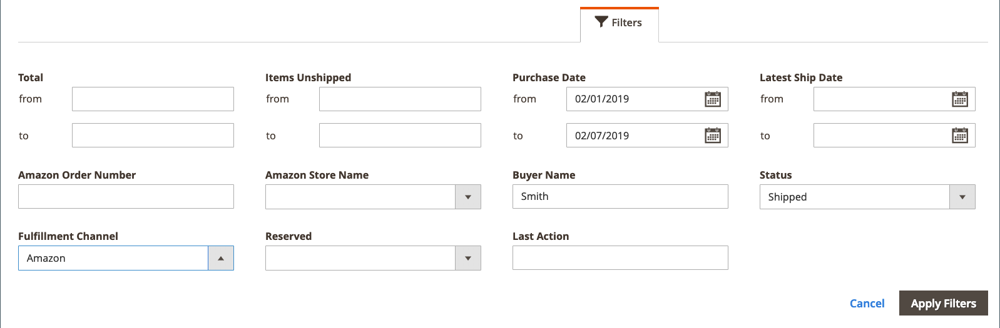

# Arbetsytekontroller

Amazon försäljningskanal [hemsida](./amazon-sales-channel-home.md) har vissa vanliga kontroller för arbetsytan, bland annat Filter, Standardvy, Kolumner och Exportera. Alla sidor har inte samma kontrollalternativ.

## Åtgärder

The _[!UICONTROL Actions]_väljaren innehåller en lista med åtgärder som är tillgängliga för en användare för en sida. När du väljer det här alternativet används åtgärden på alla markerade objekt. Om du vill använda en åtgärd på ett visst objekt markerar du kryssrutan i den första kolumnen för varje objekt och väljer ett alternativ under_[!UICONTROL Actions]_.

När väljaren till exempel visas på _[!UICONTROL Attributes]_sidan innehåller_[!UICONTROL Re-import Product Attribute Values]_ åtgärd. Om du väljer den här åtgärden skickas motsvarande [!DNL Amazon Seller Central] kontot och uppdaterar [!DNL Commerce] data för var och en av Amazon-lagringsobjekten som har checkats in i den vänstra kolumnen.

## Filter

The _[!UICONTROL Filters]_-kontrollen visar alternativ för att begränsa de data som visas i tabellen. Filteralternativen baseras på de kolumner som är markerade i kontrollen Kolumner. Filteralternativen visas bara för kolumner som är aktiverade i kolumnkontrollen.

Filterkontroller kan innehålla dynamiska kalendrar för att begränsa data för angivna datum, listrutor för kolumner som har fördefinierade markeringar och fritextfält som kan innehålla anpassade data.

I följande exempel visas inställningarna för filtrering av listan med order så att endast order som uppfyller följande villkor visas:

- beställningar som gjorts mellan 2019-02-01 och 07-02-07 2019, och
- Beställningar med en köpare som heter `Smith`och
- Beställningar med statusen `Shipped`.

När du har angett filtreringsalternativ klickar du på **[!UICONTROL Apply Filters]** för att filtrera de data som visas. Klicka på Avbryt om du vill avsluta filterkontrollen utan att använda.

När du har tillämpat filter på dina data **[!UICONTROL Active Filters]** visas. Du kan klicka på  om du vill ta bort ett visst filteralternativ eller klicka på **[!UICONTROL Clear All]** för att rensa alla använda filter.

## Visa

Vykontrollen baseras på standardkolumnerna för sidan och kallas därför standardvy. Du kan lägga till eller ta bort tillgängliga kolumner med hjälp av kontrollen Kolumner. När du anpassar kolumnerna kan du sedan spara vyn som en anpassad vy i kontrollen Visa.

När du har lagt till eller tagit bort kolumner från sidvisningen:

1. Klicka **[!UICONTROL Default View]** > **[!UICONTROL Save View As...]**.

1. Ange ett namn för vyn.

1. Om du vill spara den anpassade vyn klickar du på pilikonen.

I det här exemplet _Order-ID_ kolumnen läggs till i kolumnkontrollen och sparas som en anpassad vy. Observera att när namnet på den anpassade vyn har sparats har namnet på vyn ändrats från _Standardvy_ till det angivna namnet.

Du kan växla mellan vyerna genom att välja önskad vy i dialogrutan _[!UICONTROL View]_-menyn.

Om du vill ta bort eller ändra namnet på den anpassade vyn klickar du på pennikonen. Du kan sedan ange ett annat namn eller klicka på papperskorgsikonen för att ta bort den anpassade vyn. Det går inte att ta bort standardvyn.

## Kolumner

Med kontrollen Kolumner kan du lägga till eller ta bort kolumner med data från sidvisningen. Varje Amazon-sida för försäljningskanaler har en förinställd kombination av datakolumner, men de flesta sidor har ytterligare kolumner tillgängliga. Om inga ytterligare kolumner är tillgängliga kan du fortfarande ta bort standardkolumner från visningen.

I följande exempel visas en kolumnkontroll. De markerade alternativen motsvarar kolumnrubrikerna som visas på sidan.

- Markera kryssrutan om du vill lägga till en datakolumn på sidan.
- Markera inte kryssrutan om du vill ta bort en datakolumn från sidan.

Kryssrutan visas omedelbart. Om du gör ändringar och avslutar sidan återgår sidan till standardkolumnvisningen. För ändringar som du gör regelbundet kan du spara kolumnändringarna som en anpassad vy i kontrollen Visa. Sedan kan du växla i kontrollen Visa utan att behöva lägga till eller ta bort kolumner manuellt.

Du kan klicka **[!UICONTROL Reset]** för att återställa standardinställningarna eller så kan du klicka på **[!UICONTROL Cancel]** för att avsluta utan ändringar.

## Exportera

Med alternativet Exportera kan du exportera data till en datafil än vad som kan importeras till ett tredjepartsprogram eller en separat databas. Exporterade data är begränsade till de data som visas. Om det behövs kontrollerar du att du lägger till eller tar bort kolumner innan du använder exportkontrollen.

När du är klar att exportera dina data väljer du ett alternativ för exportformat och klickar på **[!UICONTROL Export]**.

- CSV - en kommaavgränsad värdefil som innehåller oformaterade textdata
- Excel XML - ett XML-baserat kalkylbladsdataformat (används vanligtvis för Excel-användare)

Den genererade datafilen sparas automatiskt i den mapp som du har angett för nedladdning.

