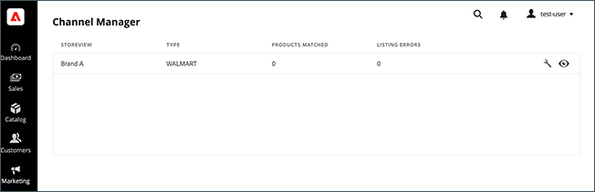

# Slutför Sales Channel

När du har anslutit en [!DNL Commerce]-butik till [!DNL Walmart Marketplace] slutför du butiksinställningarna från startsidan för [!DNL Channel Manager].

1. Välj **[!UICONTROL Marketing** > **Kanalhanteraren**] i Admin.

   {width="500" zoomable="yes"}

1. Öppna butiken för säljkanaler genom att välja en ögonikon för butiken.

1. Starta säljkanalsåtgärder.

   - [Konfigurera kanalinställningar för produktidentifierare och transportföretag](settings-overview.md)

   - [Lägg till produkter från din [!DNL Commerce Catalog] till Channel Manager](add-products-to-channel-store.md)

   - [Anslut produktlistor till  [!DNL Walmart] med produktmatchning](connect-listings-to-marketplace.md)

   - [Lär dig hur [!DNL Channel Manager] synkroniserar lager- och prisuppdateringar mellan [!DNL Commerce] och [!DNL Walmart]](inventory-and-price-updates.md)

   - [Visa och hantera [!DNL Walmart Marketplace] beställningar från  [!DNL Commerce Admin]](manage-orders.md)

   - [Hantera orderreturer och återbetalningar](return-refund-orders.md)

När du har skapat försäljningskanalen och matchat produkter med [!DNL Walmart Marketplace] kan du hantera alla produktlistor, lager, priser, order, leveranser, annulleringar, returer och återbetalningar från [!DNL Commerce]. Listor, lager, priser och orderdata synkroniseras automatiskt från [!DNL Commerce] till [!DNL Walmart Marketplace]. Uppdatera inte produkt- eller orderdata för [!DNL Commerce]-produkter från [!DNL Walmart Marketplace]-kontot för att förhindra konflikter eller avvikelser mellan [!DNL Commerce] och [!DNL Walmart Marketplace]-uppdateringar.

>[!IMPORTANT]
>
>Om [!DNL Channel Manager] returnerar fel under orderbearbetningen kan du slutföra beställnings-, leverans- eller annulleringsåtgärderna från [!DNL Walmart Marketplace]. Se [Korrigera ordningsfel](process-orders.md#fix-order-errors).
