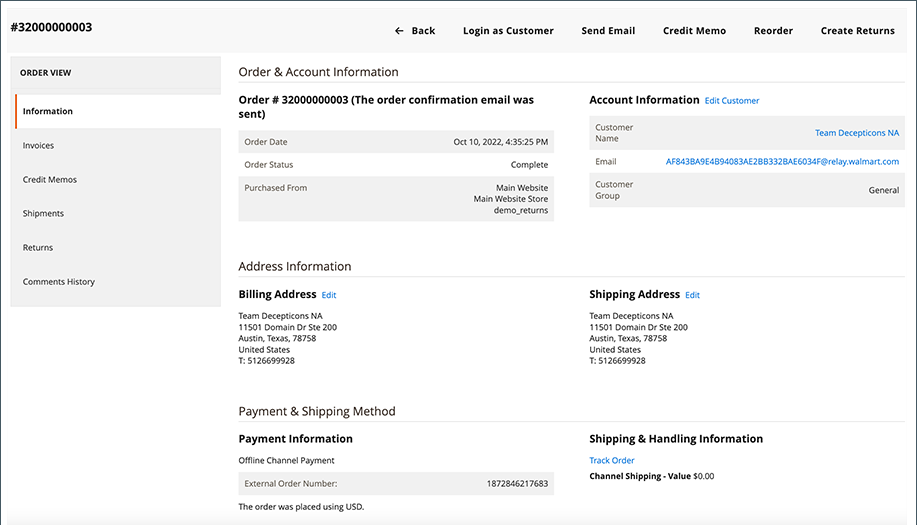

# Hantera Walmart Marketplace-beställningar

[!DNL Walmart Marketplace] order för [!DNL Commerce] produktlistor synkroniseras automatiskt till [!DNL Channel Manager] efter att Walmart har bearbetat ordern. När synkroniseringen är klar kan du visa orderinformation genom att välja **[!UICONTROL Orders]** från den anslutna kanalbutiksvyn i [!DNL Channel Manager].

>[!NOTE]
>
>Det kan ta upp till 35 minuter i en [!DNL Walmart Marketplace] ordningen som visas i [!DNL Channel Manager] orderlista. [!DNL Walmart] tar ca 30 minuter att bearbeta inkommande order och skicka dem till [!DNL Channel Manager].  När Channel Manager tar emot beställningen tar det ytterligare fem minuter att skapa och visa beställningen i Adobe Commerce eller Magento Open Source.

## Granska beställningar

1. Välj **[!UICONTROL Marketing]** > **[!UICONTROL Channel Manager]** för att öppna [!UICONTROL Channel Manager Marketplace Stores] sida.

1. Öppna butiksvyn genom att välja pennikonen i en butikspostrad.

1. Om du vill visa orderinformation väljer du *[!UICONTROL *Orders]**.

## Visa orderdetaljer

När en beställning har tagits emot från marknadsplatsen och importerats till Adobe Commerce eller Magento Open Source använder du [!DNL Commerce] Order-ID för att visa ordern i Adobe Commerce.

Från **[!UICONTROL Orders]** väljer du [!UICONTROL Commerce Order Number] för att öppna [!DNL Commerce]  orderdetaljer.

### Beställningskontroller och kolumnbeskrivningar

I följande tabeller beskrivs de kontroller och kolumner som är tillgängliga för beställningar.

**Kontroller för[!UICONTROL Orders]**
| **Kontroll**                    | **Beskrivning**                                                                                                                                               | |—|—| | [!UICONTROL Filter orders]     | Sortera vyn genom att välja ett av alternativen [!UICONTROL Order Status] kort.                                                                                        | | Information om felmeddelande | Hovra över [!UICONTROL Error Status] om du vill se ett detaljerat felmeddelande.                                                                      | | [!UICONTROL View order detail] | Om du vill visa orderdetaljer väljer du [!DNL Commerce] ordernummer i [!UICONTROL Order] tabell. Använd sedan [!DNL Commerce] orderalternativ för att bearbeta ordern. |

**Kolumnbeskrivningar**

| Fält | Beskrivning |
|------------------------------------|----------------------------------------------------------------------------------------------------------------------------------------------------------------------------------------------------------------------------------------------------------------------------------------------------------------------------------------------------------------------------------|
| [!UICONTROL  Walmart Order Number] | Inköpsordernummer som tilldelats ordern i [!DNL Walmart Marketplace]. När en order importeras till [!DNL Channel Manager]visas bara Walmart-ordernumret. När [!DNL Commerce] order skapas, [!DNL Walmart] ordernumret lagras i [!UICONTROL External ID] produktattribut. |
| [!DNL Commerce]  Ordernummer | Numret som tilldelats [!DNL Commerce]  order som skapats från [!DNL Walmart Marketplace] beställa. |
| Objekt | Antal beställda artiklar [!DNL Walmart Marketplace]. |
| [!UICONTROL Order Value] | Total kostnad för beställda artiklar. |
| [!UICONTROL Date Created] | Det datum då ordern skapades den [!DNL Walmart Marketplace]. |
| [!UICONTROL Ship By Date] | Datum då ordern måste levereras av för att uppfylla [!DNL Walmart Marketplace] krav. |
| [!UICONTROL Order Status] | Anger aktuell orderstatus i [!DNL Commerce] orderarbetsflöde. Statusen uppdateras när du har lagt till produkter i [!DNL Channel Manager] och när du matchar produkter på [!DNL Walmart Marketplace]. Om en åtgärd misslyckas visas felstatusen i listan. När du har åtgärdat felet [!DNL Channel Manager] försöker utföra åtgärden igen och uppdaterar statusen. |

### Om orderstatus

[!UICONTROL Order Status] innehåller information om det aktuella läget för [!DNL Walmart Marketplace] beställningar som hanteras från Adobe Commerce eller Magento Open Source. Uppdateringar av orderstatus när [!DNL Channel Manager] får uppdaterad orderinformation från antingen [!DNL Walmart Marketplace] eller [!DNL Commerce] ordersystem. Order kan ha följande status:

* **[!UICONTROL Open]**-Beställningar från [!DNL Walmart Marketplace] som kan granskas och behandlas i Adobe Commerce eller Magento Open Source.

   Efter att kunden beställt en produkt från [!DNL Walmart Marketplace]kan det ta upp till 35 minuter för den öppna ordern att visas i orderarbetsytan för den anslutna kanalen. [!DNL Commerce] tar ca 30 minuter att bearbeta inkommande order och skicka dem till [!DNL Channel Manager]. När Channel Manager tar emot beställningen tar det ytterligare fem minuter att skapa och visa [!DNL Commerce] beställa.

* **[!UICONTROL Processed]**-Beställningar som har skickats, annullerats eller återbetalats från [!DNL Commerce] butik.

   Om du vill visa alla levererade, annullerade och återfinansierade order väljer du **Behandlad** statuskort.

* **[!UICONTROL Canceled]**-Beställningar som har avbrutits från [!DNL Commerce] butik.

   När ordern har annullerats [!DNL Commerce] Uppdateringar av lagerkvantitet för att spegla returnerade artiklar. Sedan [!DNL Channel Manager] synkroniserar uppdateringen till [!DNL Walmart Marketplace].

* **[!UICONTROL Refunded]**-Beställningar som har återbetalats från [!DNL Commerce] butik.

   När återbetalningen är klar [!DNL Commerce] Uppdateringar av lagerkvantitet för att spegla återförda artiklar. Sedan [!DNL Channel Manager] synkroniserar uppdateringen till [!DNL Walmart Marketplace].

* **[!UICONTROL Error]**- Beställningar som inte har importerats till orderdatabasen på grund av saknad information eller andra problem.

   Om du vill visa felmeddelandeinformationen håller du muspekaren över *[!UICONTROL Error]* statusindikator. När du har åtgärdat felet uppdateras beställningen automatiskt så att aktuell information och aktuell status visas.
