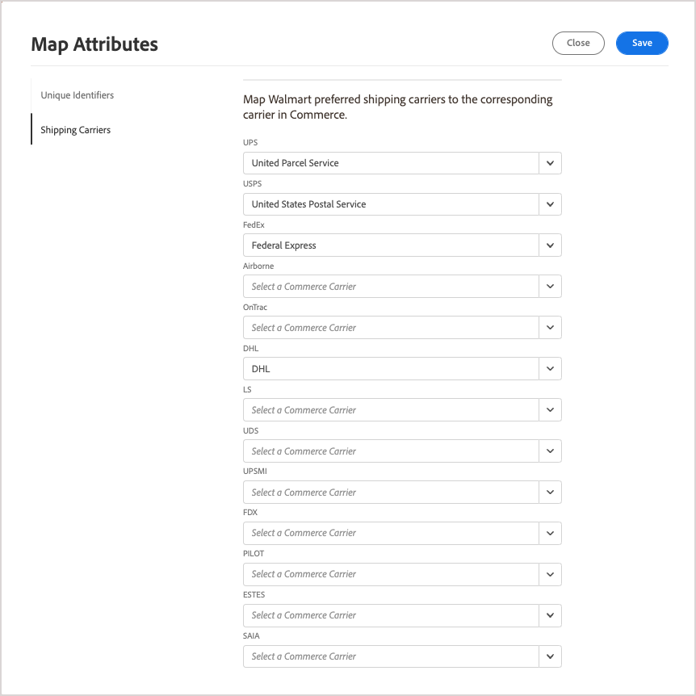

# Kartlägg transportföretag

Innan du [processorderförsändelser](process-orders.md#ship-an-order) for [!DNL Walmart Marketplace] beställningar, karta Walmart rekommenderade fraktföretag till motsvarande fraktfirma i [!DNL Commerce] så att leveransdata kan synkroniseras mellan [!DNL Walmart] och [!DNL Commerce].

Commerce-transportföretag som inte mappar till en föredragen leverantör är märkta som *[!UICONTROL Other Carrier]* på [!DNL Walmart].

**Förutsättningar**

Utför följande uppgifter innan du mappar transportföretag:

1. Granska [Bärarmetoder och bästa leveransmetoder för leverans i tid](https://sellerhelp.walmart.com/s/guide?article=000009473) for [!DNL Walmart Marketplace].

1. Verifiera [[!UICONTROL Shipping Carrier]](https://docs.magento.com/user-guide/shipping/carriers.html) och [[!UICONTROL Shipping Settings]](https://docs.magento.com/user-guide/configuration/sales/shipping-settings.html) i din [!DNL Commerce] lagra för att säkerställa att du har optimerat konfigurationen för [!DNL Walmart Marketplace sales].

## Kartlägg transportföretag

1. Från **[!UICONTROL Listings]** eller **[!UICONTROL Orders]** sida, markera **[!UICONTROL Channel Settings]**.

1. På **[!UICONTROL Channel Settings]**, markera **[!UICONTROL Shipping Carriers]**.

   

1. För varje [!DNL Walmart] önskad leverantör visas. Välj [!DNL Commerce] transportföretagets namn i listrutan om transportföretaget är tillgängligt.

1. Välj **[!UICONTROL Save]** för att tillämpa konfigurationen.

